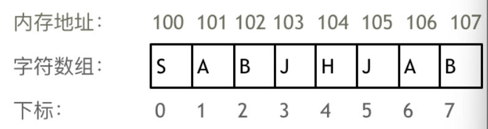
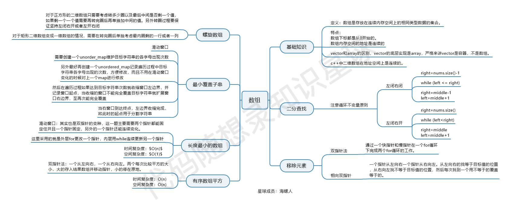

数组是存放在连续内存空间上的相同类型数据的集合。

数组可以方便的通过下标索引的方式获取到下标对应的数据。

* 数组下标都是从0开始的。
* 数组内存空间的地址是连续的

删除数组的一个元素，之后所有元素需要移动，所以数组元素不能删，只能覆盖，

1. 在C++中二维数组是连续分布的。
2. Java是没有指针的，同时也不对程序员暴露其元素的地址，寻址操作完全交给虚拟机，二维数组的每一行头结点的地址是没有规则的。
3. 原生的 Python 列表（嵌套列表）布局与 Java 几乎完全一致（非全局连续）；而 NumPy 数组则与 C++ 一致（严格连续）。

