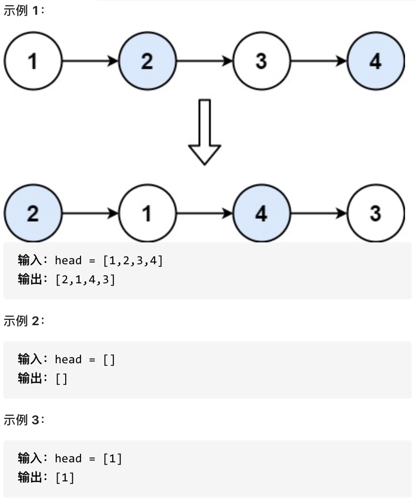
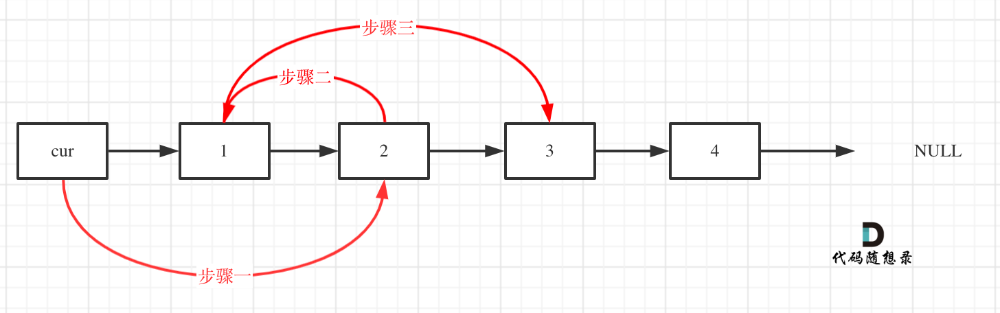
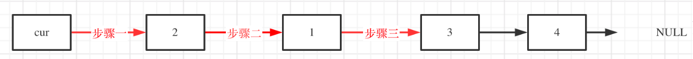

<https://leetcode.cn/problems/swap-nodes-in-pairs/>

给定一个链表，两两交换其中相邻的节点，并返回交换后的链表。

你不能只是单纯的改变节点内部的值，而是需要实际的进行节点交换。


 思路：虚拟头节点，两两循环



```
class Solution:
    def swapPairs(self, head: Optional[ListNode]) -> Optional[ListNode]:
        xvnode=ListNode()
        xvnode.next=head
        current=xvnode
        while current.next and current.next.next:
            temp1=current.next  #1
            current.next=current.next.next   #0->2
            current=current.next   #2
            temp3=current.next #3
            current.next=temp1  #2->1
            current=current.next #1
            current.next=temp3  #1->3
        return xvnode.next
```
