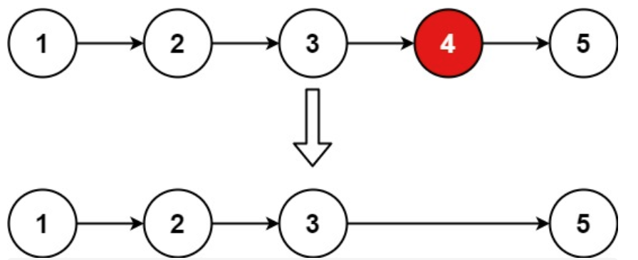

<https://leetcode.cn/problems/remove-nth-node-from-end-of-list/>

给你一个链表，删除链表的倒数第 n 个结点，并且返回链表的头结点。

进阶：你能尝试使用一趟扫描实现吗？



输入：head = [1,2,3,4,5], n = 2 输出：[1,2,3,5]

示例 2：

输入：head = [1], n = 1 输出：[]

示例 3：

输入：head = [1,2], n = 1 输出：[1]

思路：双指针：fast比slow多走n+1步，fast走到链表末尾时，slow.next就是要删的节点

```
class Solution:
    def removeNthFromEnd(self, head: Optional[ListNode], n: int) -> Optional[ListNode]:
        xvnode=ListNode()
        xvnode.next=head
        slow=xvnode
        fast=xvnode

        for i in range(n+1):
            fast=fast.next

        while fast:
            fast=fast.next
            slow=slow.next

        slow.next=slow.next.next

        return xvnode.next
```
注意：fast要先移动 n+1，这样fast为None时，slow1在要删除的节点的前一个。

