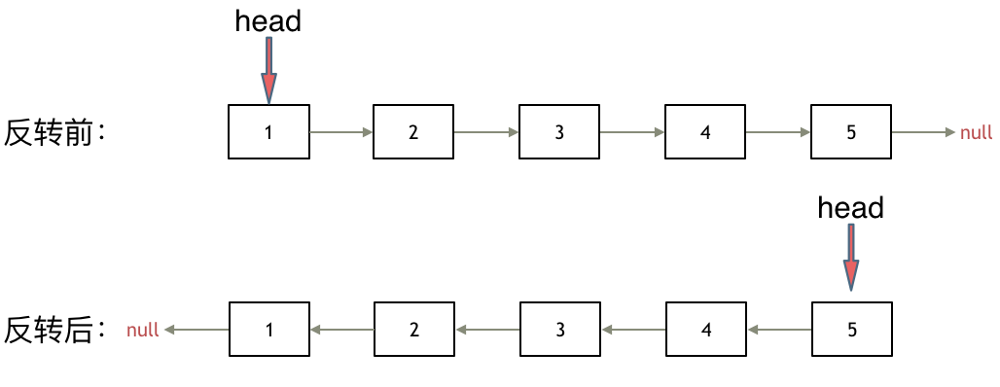

<https://leetcode.cn/problems/reverse-linked-list/>

题目描述：

题意：反转一个单链表。

示例: 输入: 1->2->3->4->5->NULL 输出: 5->4->3->2->1->NULL

思路：改变next方向



双指针法：遍历原链表，每到一个节点就让它指向前一个节点

pre从最后开始，所以定义为None，current记录节点，所以定义为head

```
class Solution:
    def reverseList(self, head: Optional[ListNode]) -> Optional[ListNode]:
        pre=None
        current=ListNode()
        current=head
        while current!=None:
            temp=current.next
            current.next=pre
            pre=current
            current=temp
        return pre
```
