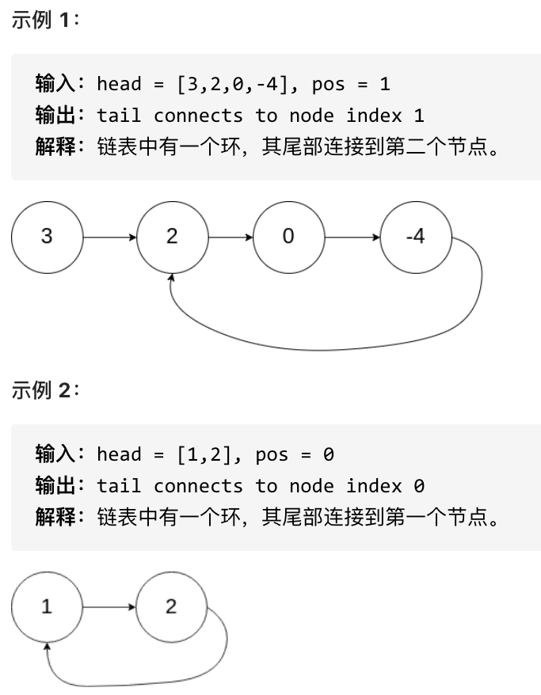
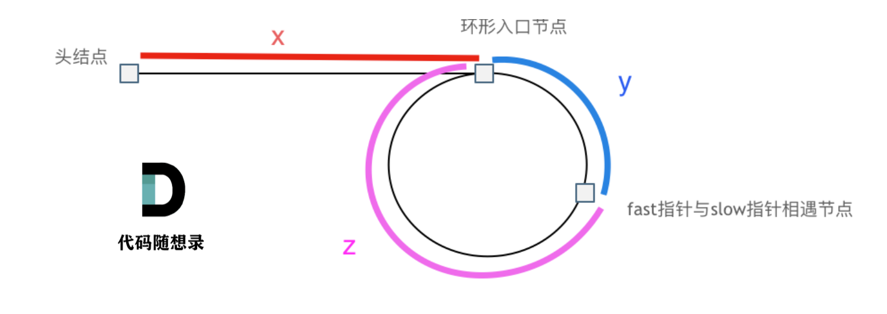

<https://leetcode.cn/problems/linked-list-cycle-ii/>

题意： 给定一个链表，返回链表开始入环的第一个节点。 如果链表无环，则返回 null。

为了表示给定链表中的环，使用整数 pos 来表示链表尾连接到链表中的位置（索引从 0 开始）。 如果 pos 是 -1，则在该链表中没有环。

**说明**：不允许修改给定的链表。



### 快慢指针法：

1. 判断链表是否环：
   
快慢指针，fast是走两步，slow是走一步。
相对于slow来说，fast是一个节点一个节点的追slow的，所以fast一定可以和slow重合，且是在环中相遇。

2. 如果有环，如何找到这个环的入口
   
假设从头结点到环形入口节点的节点数为x。环形入口节点到fast指针与slow指针相遇节点节点数为y。从相遇节点再到环形入口节点节点数为z



那么相遇时： slow指针走过的节点数为: x + y， fast指针走过的节点数：x + y + n (y + z)，n为fast指针在环内走了n圈才遇到slow指针， （y+z）为一圈内节点的个数A。

fast指针走过的节点数 = slow指针走过的节点数 * 2：
(x + y) * 2 = x + y + n (y + z)

整理公式之后为如下公式：x = (n - 1) (y + z) + z  (n>=1)

```python
# 快慢指针法
class Solution:
    def detectCycle(self, head: Optional[ListNode]) -> Optional[ListNode]:
        fast = head
        slow = head 
        while fast and fast.next:
            slow=slow.next
            fast=fast.next.next
            if slow == fast:
                index_head = head
                index_enter = fast
                while index_head != index_enter:
                    index_head=index_head.next
                    index_enter=index_enter.next
                return index_head
        return 
```

### 集合法
```python
class Solution:
    def detectCycle(self, head: Optional[ListNode]) -> Optional[ListNode]:

        visited=set()

        while head:
            if head in visited:
                return head
            visited.add(head)
            head=head.next
            
        return
```