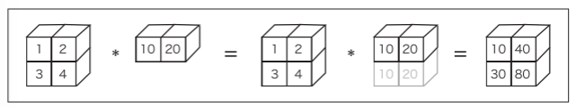
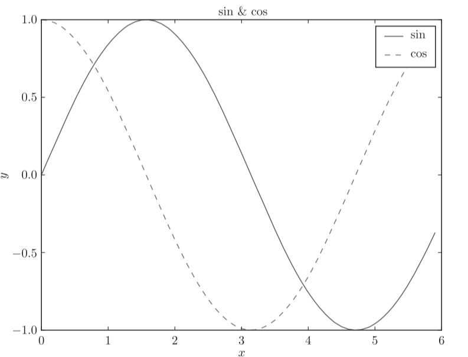
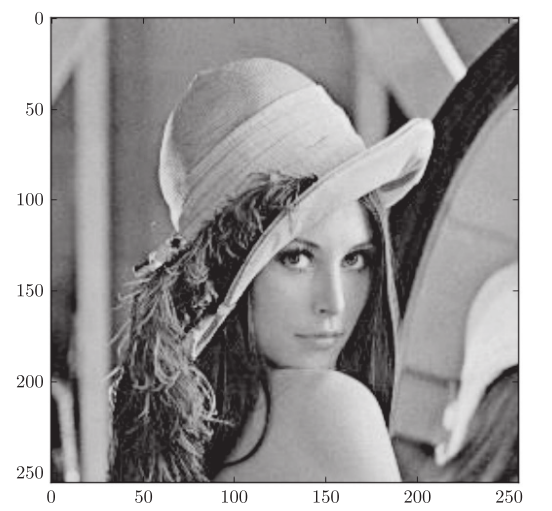

## 1.3 Python解释器

命令行窗口：

python --version #显示版本

python #启动解释器

关闭Python解释器时，Windows的情况下输入Ctrl-Z，然后按Enter

#### 1.3.1 算术计算

\*表示乘法，/表示除法，\*\*表示乘方，Python 3.x中，整数除以整数的结果是小数（浮点数）

eg.

>>>7 / 5
1.4
>>>3 \*\* 2
9

#### 1.3.2 数据类型

type()函数可以用来查看数据类型。

>>>type(10)
<class 'int'>
>>>type(2.718)
<class 'float'>
>>>type("hello")
<class 'str'>

#### 1.3.3 变量

可以使用 x 或 y 等字母定义变量（variable）

>>>x = 10 # 初始化
>>>print(x) # 输出x
10
>>>x = 100 # 赋值
>>>print(x)
100

#### 1.3.4 列表

>>>a = [1, 2, 3, 4, 5] # 生成列表
>>>print(a) # 输出列表的内容
[1, 2, 3, 4, 5]
>>>len(a) #获取列表的长度

5

##### 切片

0代表第一个元素，-1代表最后一个元素，-2代表倒数第二个元素

>>>print(a)
[1, 2, 3, 4, 99]
>>>a[0:2] # 获取索引为0到2（不包括2！）的元素
[1, 2]
>>>a[1:] # 获取从索引为1的元素到最后一个元素
[2, 3, 4, 99]

>>>a[:3] # 获取从第一个元素到索引为3（不包括3！）的元素
[1, 2, 3]
>>>a[:-1] # 获取从第一个元素到最后一个元素的前一个元素之间的元素
[1, 2, 3, 4]
>>>a[:-2] # 获取从第一个元素到最后一个元素的前二个元素之间的元素
[1, 2, 3]

#### 1.3.6 布尔型

Python中有bool型。bool型取True或False中的一个值。

针对bool型的运算符包括and、or和not

>>> hungry = True # 饿了？

>>> sleepy = False # 困了？

>>> type(hungry)

<class 'bool'>

>>> not hungry

False

>>> hungry and sleepy # 饿并且困

False

>>> hungry or sleepy # 饿或者困

True

#### 1.3.7 if语句

>>> hungry = True

>>> if hungry:

...print("I'm hungry")

I'm hungry

#### 1.3.8 for 语句

进行循环处理时可以使用for语句。

>>> for i in [1, 2, 3]:

...print(i)

1

2

3

#### 1.3.9 函数

可以将一连串的处理定义成函数（function）。

>>> def hello(object):

...print(*"Hello " + object + "!"*)

>>> hello("cat")

Hello cat!

字符串拼接可直接+

## 1.4 Python脚本文件

#### 1.4.1 保存为文件

打开文本编辑器，新建一个hungry.py的文件。

print("I'm hungry!")

打开命令行运行：

$ cd ~/deep-learning-from-scratch/ch01 # 移动目录

$ python hungry.py

I'm hungry!

#### 1.4.2 类

“内置”的数据类型 int 和 str 等数据类型通过type()函数可以查看。

如果用户自己定义类的话，就可以自己创建数据类型，定义原创的方法和属性。

class 类名：

def \_\_init\_\_(self, 参数, …): # 构造函数

...

def 方法名1(self, 参数, …): # 方法1

...

def 方法名2(self, 参数, …): # 方法2

...

\_\_init\_\_方法是进行初始化的方法，也称为构造函数（constructor）,只在生成类的实例时被调用一次。

在方法的第一个参数中明确地写入表示自身（自身的实例）的self是Python的一个特点。

class Man:

def \_\_init\_\_(self, name):

self.name = name

print("Initialized!")

def hello(self):

print("Hello " + self.name + "!")

def goodbye(self):

print("Good-bye " + self.name + "!")

m = Man("David")

m.hello()

m.goodbye()

从终端运行man.py：

$ python man.py

Initialized!

Hello David!

Good-bye David!

**实例变量**是存储在各个实例中的变量。Python中可以像self.name这样，通过在self后面添加属性名来生成或访问实例变量。

## 1.5 NumPy

Python等动态类型语言一般比C和C++等静态类型语言（编译型语言）运算速度慢。实际上，如果是运算量大的处理对象，用C/C++写程序更好。为此，当Python中追求性能时，人们会用C/C++来实现处理的内容。Python则承担“中间人”的角色，负责调用那些用C/C++写的程序。NumPy中，主要的处理也都是通过C或C++实现的。因此，我们可以在不损失性能的情况下，使用Python便利的语法。

#### 1.5.1 导入NumPy

>>> import numpy as np

Python中使用import语句来导入库。将numpy作为np导入

#### 1.5.2 生成NumPy数组

**np.array()** 接收Python列表作为参数，生成NumPy数组（numpy.ndarray）。

>>> x = np.array([1.0, 2.0, 3.0])

>>> print(x)

[ 1. 2. 3.]

>>> type(x)

<class 'numpy.ndarray'>

#### 1.5.3 NumPy 的算术运算

>>> x = np.array([1.0, 2.0, 3.0])

>>> y = np.array([2.0, 4.0, 6.0])

>>> x + y # 对应元素的加法

array([ 3., 6., 9.])

>>> x - y

array([ -1., -2., -3.])

>>> x \* y # element-wise product

array([ 2., 8., 18.])

>>> x / y

array([ 0.5, 0.5, 0.5])

当数组 x 和 y 的元素个数相同时，可以对各个元素进行算术运算。如果元素个数不同，程序就会报错，所以元素个数保持一致非常重要。

#### 1.5.4 NumPy的N维数组

NumPy不仅可以生成一维数组（排成一列的数组），也可以生成多维数组。

二维数组（矩阵），将三维数组及三维以上的数组称为“张量”或“多维数组”。

>>> A = np.array([[1, 2], [3, 4]])

>>> print(A)

[[1 2]

[3 4]]

>>> A.shape

(2, 2)

>>> A.dtype

dtype('int64')

矩阵A的形状可以通过 **shape** 查看，矩阵元素的数据类型可以通过 **dtype** 查看。

>>> B = np.array([[3, 0],[0, 6]])

>>> A + B

array([[ 4, 2],

[ 3, 10]])

>>> A \* B

array([[ 3, 0],

[ 0, 24]])

矩阵的算术运算也可以在相同形状的矩阵间以对应元素的方式进行。

#### 1.5.5 广播

数组和标量（或不同形状数组）运算时，标量（或不同形状数组）会先拓展成与原数组相同形状，再运算。

>>> A = np.array([[1, 2], [3, 4]])

>>> B = np.array([10, 20])

>>> A \* B

array([[ 10, 40],

[ 30, 80]])

#### 1.5.6 访问元素

元素的索引从0开始。

索引访问：

>>> X = np.array([[51, 55], [14, 19], [0, 4]])

>>> print(X)

[[51 55]

[14 19]

[ 0 4]]

>>> X[0] # 第0行

array([51, 55])

>>> X[0][1] # (0,1)的元素

55

数组访问：

>>> X = X.flatten() # 将X转换为一维数组

>>> print(X)

[51 55 14 19 0 4]

>>> X[np.array([0, 2, 4])] # 获取索引为0、2、4的元素

array([51, 14, 0])

使用不等号运算符等,结果会得到一个布尔型的数组：

>>> X > 15

array([ True, True, False, True, False, False], dtype=bool)

>>> X[X>15]

array([51, 55, 19])

## 1.6 Matplotlib

#### 1.6.2 pyplot的功能

import numpy as np

import matplotlib.pyplot as plt

# 生成数据

x = np.arange(0, 6, 0.1) # 以0.1为单位，生成0到6的数据

y1 = np.sin(x)

y2 = np.cos(x)

# 绘制图形

plt.plot(x, y1, label="sin")

plt.plot(x, y2, linestyle = "--", label="cos") # 用虚线绘制

plt.xlabel("x") # x轴标签

plt.ylabel("y") # y轴标签

plt.title('sin & cos') # 标题

plt.legend() #添加图例

plt.show()

#### 1.6.3 显示图像

import matplotlib.pyplot as plt

from matplotlib.image import imread

img = imread('lena.png') # 读入图像（设定合适的路径！）

plt.imshow(img)

plt.show()

