机器学习的课题就是将决定感知机参数值的工作交由计算机自动进行。

**学习** 是确定合适的参数的过程，而人要做的是思考感知机的构造（模型），并把训练数据交给计算机。

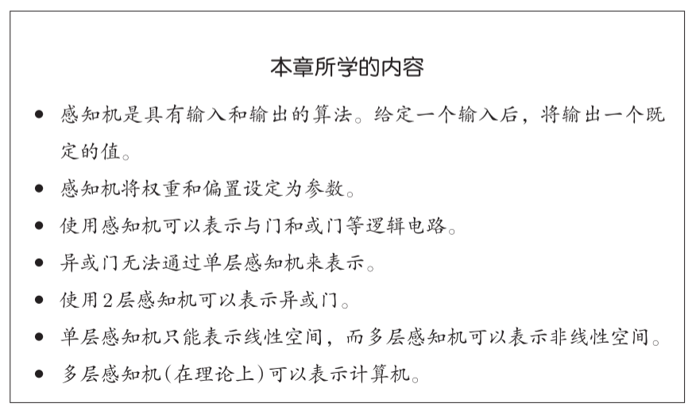

## 2.1 感知机是什么

感知机接收多个输入信号，输出一个信号。

感知机的信号只有“流/不流”（1/0）两种取值。

x1、x2是输入信号，y是输出信号，w1、w2是权重。输入信号被送往神经元时，会被分别乘以固定的权重（w1x1、w2x2）。神经元会计算传送过来的信号的总和，只有当这个总和超过了某个界限值时，才会输出1。这也称为“神经元被激活” 。这里将这个界限值称为阈值，用符号θ表示。

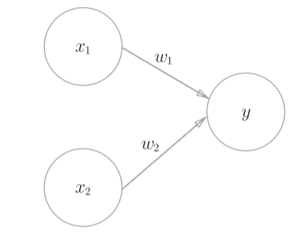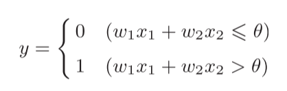

## 2.2 简单逻辑电路

#### 2.2.1 与门

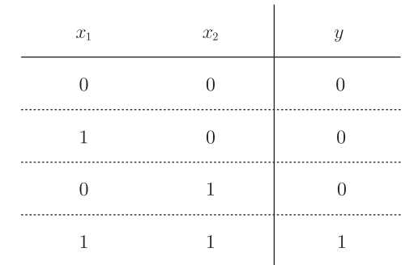

参数的选择方法有无数多个。比如，当(w1,w2, θ) = (0.5, 0.5, 0.7)时，当(w1,w2, θ)为(0.5, 0.5, 0.8)或者(1.0, 1.0, 1.0)时，都满足与门的条件。

#### 2.2.2 与非门和或门

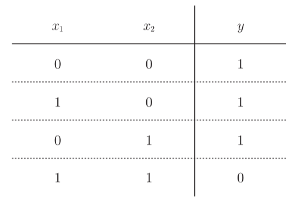与非门参数可设为：(w1,w2, θ) = (−0.5, −0.5, −0.7)

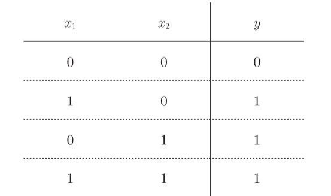或门参数可设为：(w1,w2, θ) = (0.5, 0.5, 0.2)

## 2.3 感知机的实现

#### 2.3.1 简单实现

def AND(x1, x2):

w1, w2, theta = 0.5, 0.5, 0.7

tmp = x1\*w1 + x2\*w2

if tmp <= theta:

return 0

elif tmp > theta:

return 1

运行

AND(0, 0) # 输出0

AND(1, 0) # 输出0

AND(0, 1) # 输出0

AND(1, 1) # 输出1

#### 2.3.2 导入权重和偏置

把 θ 换成 −b：

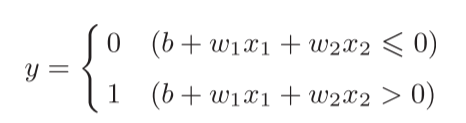b称为偏置，w1和w2称为权重

w1 和 w2 是**控制输入信号**的重要性的参数，而偏置 b 是调整神经元**被激活的容易程度**（输出信号为1的程度）的参数。

#### 2.3.3 使用权重和偏置的实现

def AND(x1, x2):

x = np.array([x1, x2])

w = np.array([0.5, 0.5])

b = -0.7

tmp = np.sum(w\*x) + b

if tmp <= 0:

return 0

else:

return 1

## 2.4 感知机的局限性

感知机的局限性就在于单层感知机只能表示由一条直线分割的空间。

#### 2.4.1 异或门

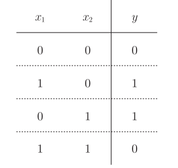感知机是无法实现这个异或门的

解释：

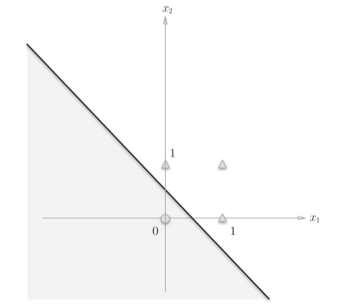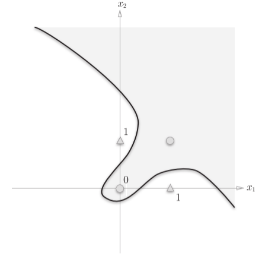

感知机的可视化：左图灰色区域是感知机输出0的区域，这个区域与或门的性质一致

曲线分割而成的空间称为非线性空间，由直线分割而成的空间称为线性空间。

## 2.5 多层感知机

叠加了多层的感知机也称为多层感知机（multi-layered perceptron）。

感知机通过叠加层能够进行非线性的表示，理论上还可以表示计算机进行的处理。

#### 2.5.1 已有门电路的组合

异或门：通过与非门，排除（1，1），通过或门排除（0，0），再将两门结果通过与门

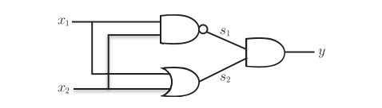

#### 2.5.2 异或门的实现

def XOR(x1, x2):

s1 = NAND(x1, x2)

s2 = OR(x1, x2)

y = AND(s1, s2)

return y

运行

XOR(0, 0) # 输出0

XOR(1, 0) # 输出1

XOR(0, 1) # 输出1

XOR(1, 1) # 输出0

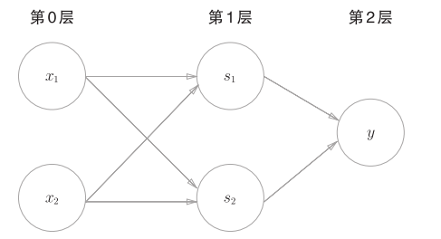

感知机总共由3层构成，但是因为拥有权重的层实质上只有2层（第0层和第1层之间，第1层和第2层之间），所以称为“2层感知机”。

