神经网络的一个重要性质是它可以自动地从数据中学习到合适的权重参数。

“朴素感知机”是指单层网络，指的是激活函数使用了阶跃函数A 的模型。

“多层感知机”是指神经网络，即使用sigmoid 函数等平滑的激活函数的多层网络。

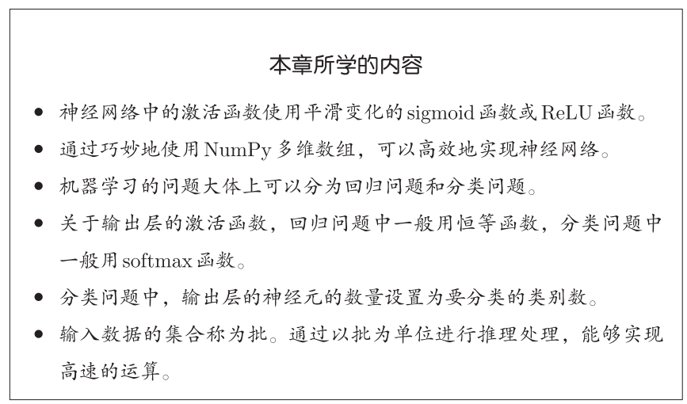

## 3.1 从感知机到神经网络

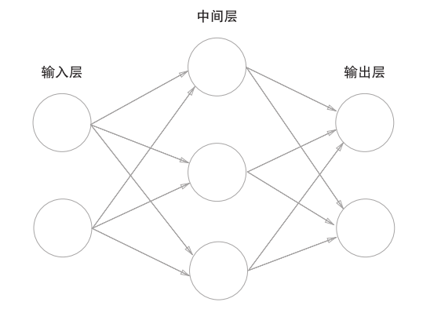

把最左边的一列称为输入层，最右边的一列称为输出层，中间的一列称为中间层（隐藏层）。把输入层到输出层依次称为第0层、第1层、第2层，分别对应输入层，中间层，输出层。

#### 3.1.2 感知机

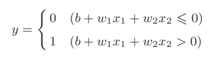

b是被称为偏置的参数，用于控制神经元被激活的容易程度

w1和w2是表示各个信号的权重的参数，用于控制各个信号的重要性。

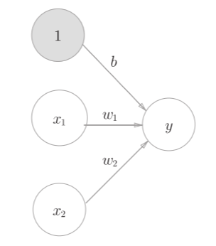明确表示出 b，b当作权重，输入信号一直为1

引入函数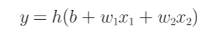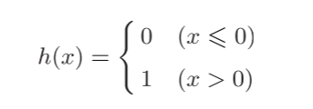

#### 3.1.3 激活函数登场

激活函数（activation function）决定如何来激活输入信号的总和。

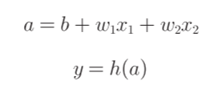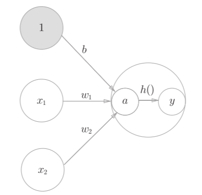

## 3.2 激活函数

在激活函数的众多候选函数中，感知机使用阶跃函数（一旦输入超过阈值，就切换输出）。

#### 3.2.1 sigmoid函数

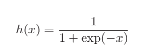exp(−x)表示e−x的意思。e是纳皮尔常数2.7182 ...。

#### 3.2.2 阶跃函数的实现

简单实现，仅接受浮点数判断：

def step\_function(x):

if x > 0:

return 1

else:

return 0

支持数组实现：

def step\_function(x):

y = x > 0

return y.astype(np.int) #True会转换为1，False会转换为0

解释：

y = x > 0 会输出一个布尔型数组 array([False, True, True], dtype=bool)

astype() 方法转换NumPy数组的类型

#### 3.2.3 阶跃函数的图形

import numpy as np

import matplotlib.pylab as plt

def step\_function(x):

return np.array(x > 0, dtype=np.int)

x = np.arange(-5.0, 5.0, 0.1)

y = step\_function(x)

plt.plot(x, y)

plt.ylim(-0.1, 1.1) # 指定y轴的范围

plt.show()

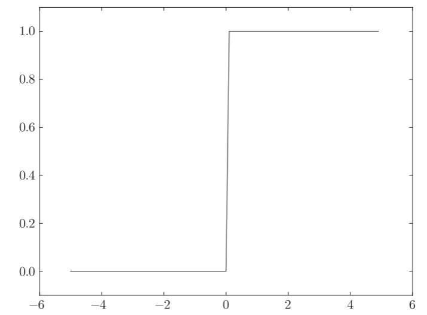

#### 3.2.4 sigmoid函数的实现

def sigmoid(x):

return 1 / (1 + np.exp(-x))

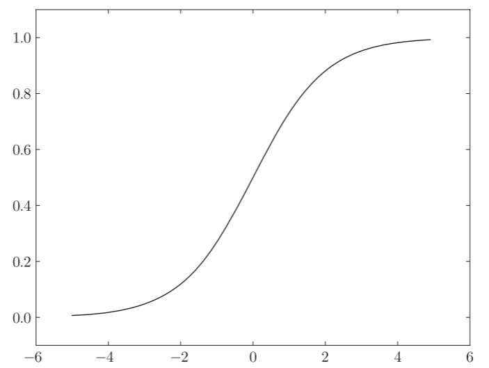

#### 3.2.5 sigmoid函数和阶跃函数的比较

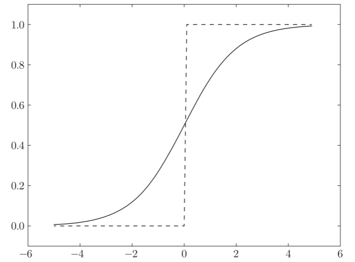

感知机中神经元之间流动的是0或1的二元信号，而神经网络中流动的是连续的实数值信号。

1. 当输入信号为重要信息时，阶跃函数和sigmoid函数都会输出较大的值；当输入信号为不重要的信息时，两者都输出较小的值。
2. 不管输入信号有多小，或者有多大，输出信号的值都在0到1之间。

#### 3.2.6 非线性函数

阶跃函数和sigmoid函数均为非线性函数。

神经网络的激活函数必须使用非线性函数。

线性函数的问题在于，不管如何加深层数，总是存在与之等效的“无隐藏层的神经网络”。使用线性函数的话，加深神经网络的层数就没有意义了。

#### 3.2.7 ReLU函数

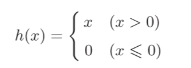

def relu(x):

return np.maximum(0, x) #maximum会从输入的数值中选择较大值

## 3.3 多维数组的运算

#### 3.3.1 多维数组

一维数组：

>>> import numpy as np

>>> A = np.array([1, 2, 3, 4])

>>> print(A)

[1 2 3 4]

>>> np.ndim(A) #得到数组维度

1

>>> A.shape  #得到数组形状

(4,)

>>> A.size #返回元素总个数

4

>>> A.shape[0] #返回的**永远只是第一个维度（轴 0）的长度**

4

二维数组：数组的横向排列称为行（row），纵向排列称为列（column）。

>>> B = np.array([[1,2], [3,4], [5,6]])

>>> print(B)

[[1 2]

[3 4]

[5 6]]

>>> np.ndim(B)

2

>>> B.shape

(3, 2)

>>> B.shape[0] #第一个维度行数

3

>>> B.shape[1] #第二个维度列数

2

#### 3.3.2 矩阵乘法（点积）

与 \* 不同，无交换律：np.dot(A, B)和np.dot(B, A)的值可能不一样

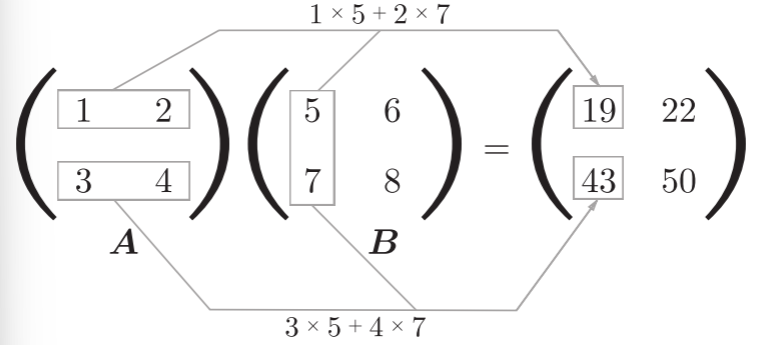

>>> A = np.array([[1,2], [3,4]])

>>> A.shape

(2, 2)

>>> B = np.array([[5,6], [7,8]])

>>> B.shape

(2, 2)

>>> np.dot(A, B)

array([[19, 22],

 [43, 50]])

注意对应维度的元素个数要保持一致（仅第一个列和第二个行相等即可）

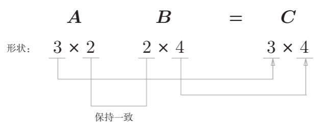

#### 3.3.3 神经网络的内积（使用点积）

省略了偏置和激活函数，只有权重

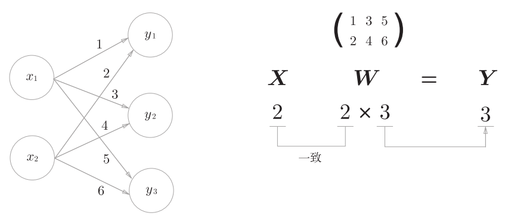

X和W的对应维度的元素个数需要一致

>>> X = np.array([1, 2])

>>> X.shape

(2,)

>>> W = np.array([[1, 3, 5], [2, 4, 6]])

>>> print(W)

[[1 3 5]

[2 4 6]]

>>> W.shape

(2, 3)

>>> Y = np.dot(X, W)

>>> print(Y)

[ 5 11 17]

通过矩阵的乘积可以一次性完成计算。

## 3.4 3层神经网络的实现

神经网络的运算可以作为矩阵运算打包进行

#### 3.4.1 符号确认

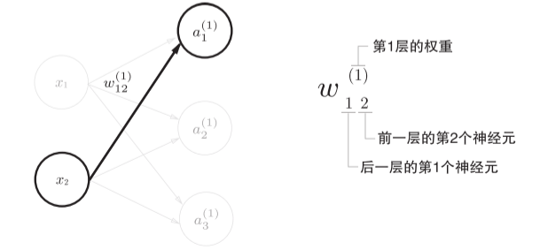

先后再前

#### 3.4.2 各层间信号传递的实现

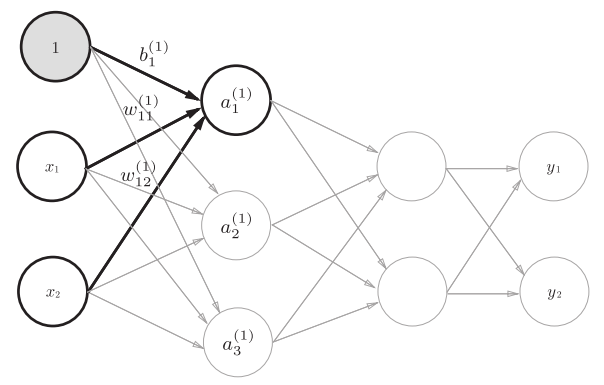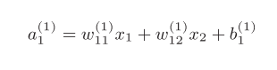

任何前一层的偏置神经元“1”都只有一个。偏置权重的数量取决于后一层的神经元的数量

使用矩阵乘法：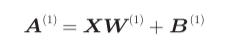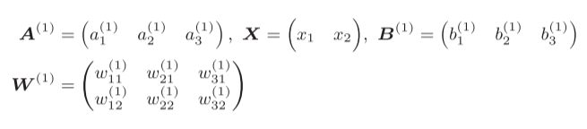

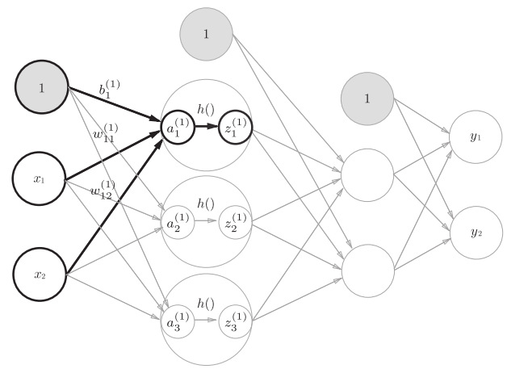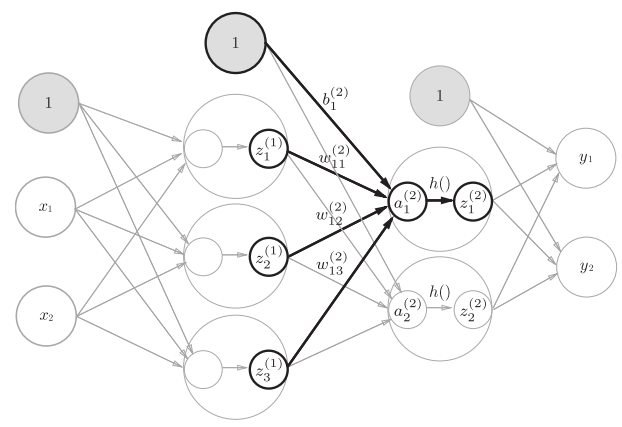

X = np.array([1.0, 0.5])

W1 = np.array([[0.1, 0.3, 0.5], [0.2, 0.4, 0.6]])

B1 = np.array([0.1, 0.2, 0.3])

print(W1.shape) # (2, 3)

print(X.shape) # (2,)

print(B1.shape) # (3,)

A1 = np.dot(X, W1) + B1

加上激活函数：Z1 = sigmoid(A1)

W2 = np.array([[0.1, 0.4], [0.2, 0.5], [0.3, 0.6]])

B2 = np.array([0.1, 0.2])

A2 = np.dot(Z1, W2) + B2

Z2 = sigmoid(A2)

第2层到输出层：

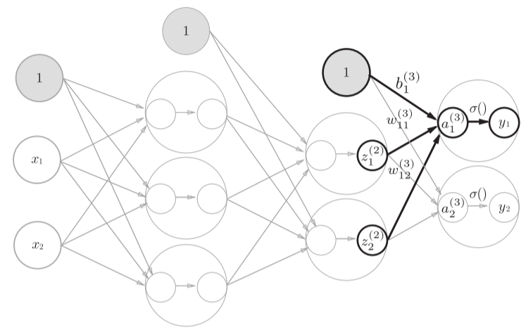

def identity\_function(x):

return x

W3 = np.array([[0.1, 0.3], [0.2, 0.4]])

B3 = np.array([0.1, 0.2])

A3 = np.dot(Z2, W3) + B3

Y = identity\_function(A3) # 或者Y = A3

identity\_function()函数称为“恒等函数”，会将输入按原样输出。输出层的激活函数用σ()表示，不同于隐藏层的激活函数h()（σ读作sigma）。

回归问题可以使用恒等函数，二元分类问题可以使用sigmoid函数，多元分类问题可以使用softmax函数。

#### 3.4.3 代码小结

#权重和偏置的初始化，并将它们保存在字典变量network中。

def init\_network():

network = {}

network['W1'] = np.array([[0.1, 0.3, 0.5], [0.2, 0.4, 0.6]])

network['b1'] = np.array([0.1, 0.2, 0.3])

network['W2'] = np.array([[0.1, 0.4], [0.2, 0.5], [0.3, 0.6]])

network['b2'] = np.array([0.1, 0.2])

network['W3'] = np.array([[0.1, 0.3], [0.2, 0.4]])

network['b3'] = np.array([0.1, 0.2])

return network

#封装了将输入信号转换为输出信号的处理过程。

def forward(network, x):

W1, W2, W3 = network['W1'], network['W2'], network['W3']

b1, b2, b3 = network['b1'], network['b2'], network['b3']

a1 = np.dot(x, W1) + b1

z1 = sigmoid(a1)

a2 = np.dot(z1, W2) + b2

z2 = sigmoid(a2)

a3 = np.dot(z2, W3) + b3

y = identity\_function(a3)

return y

network = init\_network() #初始化网络

x = np.array([1.0, 0.5])

y = forward(network, x) #由网络和输入得到输出

print(y) # [ 0.31682708 0.69627909]

字典变量network中保存了每一层所需的参数（权重和偏置）

## 3.5 输出层的设计

分类问题是数据属于哪一个类别的问题。

* 多分类问题一般用softmax函数，取概率最大的一类
* 二分类问题一般用sigmoid函数，概率与50%阈值比较，>0.5判为正类，否则为负类

回归问题是根据某个输入预测一个（连续的）数值的问题。一般用恒等函数。

#### 3.5.1 恒等函数和softmax函数

恒等函数，输入信号原封不变的输出

softmax函数：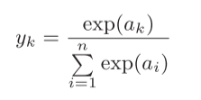exp(x)是表示ex的指数函数

def softmax(a):

exp\_a = np.exp(a)

sum\_exp\_a = np.sum(exp\_a)

y = exp\_a / sum\_exp\_a

 #输出如array([ 9.99954600e-01,4.53978686e-05,2.06106005e-09])

return y

* softmax 缺陷：

实现中要进行指数函数的运算，容易溢出，可以先减去输入信号中的最大值

def softmax(a):

c = np.max(a)

exp\_a = np.exp(a - c) # 溢出对策

sum\_exp\_a = np.sum(exp\_a)

y = exp\_a / sum\_exp\_a

return y

* softmax 特征
1. 输出是0.0到1.0之间的实数
2. 输出值的总和是1
3. 通过使用softmax函数，我们可以用概率的（统计的）方法处理问题，即将各类别结果看作对应概率
4. 各个元素之间的大小关系不会改变，递增函数
5. 神经网络在进行分类时只取输出最大值，输出层的softmax函数作用后大小不变，可以省略

#### 3.5.4 输出层的神经元数量

输出层的神经元数量需要根据待解决的问题来决定。

对于分类问题，输出层的神经元数量一般设定为类别的数量。10分类问题就可以设为10个

## 3.6 手写数字识别

求解机器学习问题的步骤可以分为“学习”模型对未知的数据进行推理（分类）和“推理”两个阶段。首先，在学习阶段进行模型的学习，然后，在推理阶段，用学到的模型对未知的数据进行推理（分类），推理处理也称为神经网络的前向传播（forward propagation）。

#### 3.6.1 MNIST数据集

MNIST手写数字图像集是由0到9的数字图像构成的，MNIST数据集的一般使用方法是，先用训练图像进行学习，再用学习到的模型度量能在多大程度上对测试图像进行正确的分类。

MNIST的图像数据是28像素 × 28像素的灰度图像（1通道），各个像素的取值在0到255之间。每个图像数据都相应地标有“7”“2”“1”等标签。

Python有pickle这个便利的功能。这个功能可以将程序运行中的对象保存为文件。如果加载保存过的pickle文件，可以立刻复原之前程序运行中的对象。

将数据整体的分布形状均匀化的方法，即数据白化（whitening）

把数据限定到某个范围内的处理称为正规化（normalization）

对神经网络的输入数据进行某种既定的转换称为预处理（pre-processing）

#### 3.6.3 批处理

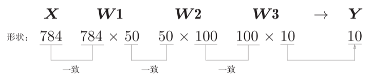数组形状变化

predict()函数一次性打包处理100张图像，x的形状改为100 × 784

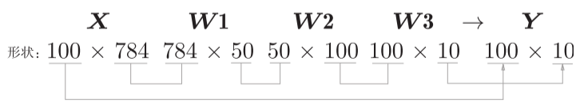

输入数据的形状为100 × 784，输出数据的形状为100 × 10，输入的100张图像的结果被一次性输出了。

打包式的输入数据称为批（batch），批处理一次性计算大型数组要比分开逐步计算各个小型数组速度更快。

x, t = get\_data()

network = init\_network()

batch\_size = 100 # 批数量

accuracy\_cnt = 0

for i in range(0, len(x), batch\_size):

x\_batch = x[i:i+batch\_size]

y\_batch = predict(network, x\_batch)

#argmax()获取值最大的元素的索引，axis=1表示沿着第1维方向找

p = np.argmax(y\_batch, axis=1)

accuracy\_cnt += np.sum(p == t[i:i+batch\_size])

print("Accuracy:" + str(float(accuracy\_cnt) / len(x)))

