“学习”是指从训练数据中自动获取最优权重参数的过程。

学习的目的就是以该损失函数为基准，找出能使它的值达到最小的权重参数。

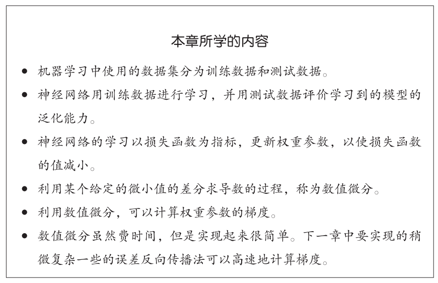

## 4.1 从数据中学习

神经网络的特征就是可以从数据中学习。所谓“从数据中学习”，是指可以由数据自动决定权重参数的值。

深度学习有时也称为端到端机器学习（end-to-end machine learning），是从原始数据（输入）中获得目标结果（输出）的意思。

与待处理的问题无关，神经网络可以将数据直接作为原始数据，进行“端对端”的学习。

为了正确评价模型的泛化能力，就必须划分训练数据和测试数据。机器学习中，一般将数据分为训练数据（监督数据）和测试数据两部分来进行学习和实验等。

只对某个数据集过度拟合的状态称为过拟合（over fitting）

## 4.2 损失函数

神经网络以损失函数（loss function）为线索寻找最优权重参数，一般用均方误差和交叉熵误差等。

#### 4.2.1 均方误差

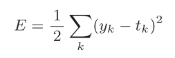yk是表示神经网络的输出，tk表示监督数据，k表示数据的维数。

将正确解标签表示为1，其他标签表示为0的表示方法称为one-hot表示。

def mean\_squared\_error(y, t):

return 0.5 \* np.sum((y-t)\*\*2)

#### 4.2.2 交叉熵误差

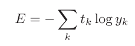log表示以e为底数的自然对数（log e），yk是神经网络的输出，tk是正确解标签，tk中只有正确解标签的索引为1，其他均为0

交叉熵误差的值是由正确解标签所对应的输出结果决定的。

def cross\_entropy\_error(y, t):

delta = 1e-7 #微小值，避免np.log(0)会变为负无限大的-inf

return -np.sum(t \* np.log(y + delta))

#### 4.2.3 mini-batch学习

计算损失函数时必须将所有的训练数据作为对象

从全部数据中选出一部分，作为全部数据的“近似”。

神经网络的学习也是从训练数据中选出一批数据（称为mini-batch,小批量），然后对每个mini-batch进行学习。

np.random.choice()可以从指定的数字中随机选择想要的数字

>>>np.random.choice(60000, 10) #从0-59999中随机抽10个数
array([ 8013, 14666, 58210, 23832, 52091, 10153, 8107, 19410, 27260,21411])

#### 4.2.4 mini-batch版交叉熵误差的实现

当数据是onehot格式（仅1/0）：直接除以batch\_size

def cross\_entropy\_error(y, t):

if y.ndim == 1: #输出维度是1，即求单个数据交叉熵

t = t.reshape(1, t.size) #改变数据形状

y = y.reshape(1, y.size)

batch\_size = y.shape[0]

return -np.sum(t \* np.log(y + 1e-7)) / batch\_size

当数据是标签形式（如0/2/7）：

def cross\_entropy\_error(y, t):

if y.ndim == 1:

t = t.reshape(1, t.size)

y = y.reshape(1, y.size)

batch\_size = y.shape[0]

return -np.sum(np.log(y[np.arange(batch\_size), t] + 1e-7)) / batch\_size

y[np.arange(batch\_size), t] 能抽出各个数据的正确解标签对应的神经网络的输出（会生成NumPy数组如：[y[0,2], y[1,7], y[2,0],y[3,9], y[4,4]]）。

#### 4.2.5 为什么设定损失函数

在进行神经网络的学习时，不能将识别精度作为指标。

如果以识别精度为指标，则参数的导数在绝大多数地方都会变为0。

识别精度是离散值，对微小的参数变化基本上没有什么反应

损失函数是连续值

## 4.3 数值微分（numerical differentiation）

#### 4.3.1 导数

导数就是表示某个瞬间的变化量：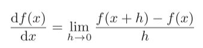

舍入误差（rounding error）是指因省略小数的精细部分的数值（比如，小数点第8位以后的数值）而造成最终的计算结果上的误差。

数值微分含有误差。(x + h)和x之间的差分称为前向差分

为了减小这个误差，可以计算函数 f 在(x + h)和(x − h)之间的差分。因为这种计算方法以 x 为中心，计算它左右两边的差分，所以也称为中心差分

def numerical\_diff(f, x):

h = 1e-4 # 0.0001

return (f(x+h) - f(x-h)) / (2\*h)

利用微小的差分求导数的过程称为数值微分。（如上）

而基于数学式的推导求导数的过程，称为解析性求导。

eg. y = x2的导数，可以解析性地求解出来。因此，当x = 2时，y的导数为4。解析性求导得到的导数是不含误差的“真的导数”。

#### 4.3.2 数值微分的例子

eg. 定义一个函数：

def function\_1(x):

return 0.01\*x\*\*2 + 0.1\*x

数值微分结果：

>>> numerical\_diff(function\_1, 5)

0.1999999999990898

>>> numerical\_diff(function\_1, 10)

0.2999999999986347

函数真实导数分别为0.2和0.3，与数值微分结果相比，误差小到基本上可以认为它们是相等的。

#### 4.3.3 偏导数

函数：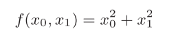

def function\_2(x):

return x[0]\*\*2 + x[1]\*\*2

# 或者return np.sum(x\*\*2)

假定向参数输入了一个NumPy数组。函数的内部实现比较简单，先计算NumPy数组中各个元素的平方，再求它们的和。

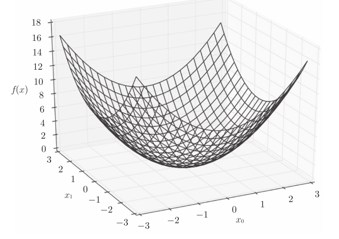

讨论的有多个变量的函数的导数称为偏导数。

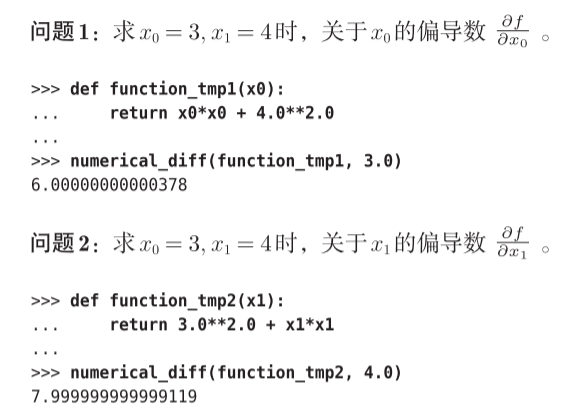

偏导数需要将多个变量中的某一个变量定为目标变量，并将其他变量固定为某个值，再求导即可。

## 4.4 梯度

如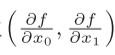，由全部变量的偏导数汇总而成的向量称为梯度（gradient）。

def numerical\_gradient(f, x):

h = 1e-4 # 0.0001

grad = np.zeros\_like(x) # 生成和x形状相同的数组

for idx in range(x.size): #对每个x都计算

tmp\_val = x[idx]

# f(x+h)的计算

x[idx] = tmp\_val + h

fxh1 = f(x)

# f(x-h)的计算

x[idx] = tmp\_val - h

fxh2 = f(x)

grad[idx] = (fxh1 - fxh2) / (2\*h)

x[idx] = tmp\_val # 还原值

return grad

求(3, 4)、(0, 2)、(3, 0)处梯度：

>>> numerical\_gradient(function\_2, np.array([3.0, 4.0]))

array([ 6., 8.])

>>> numerical\_gradient(function\_2, np.array([0.0, 2.0]))

array([ 0., 4.])

>>> numerical\_gradient(function\_2, np.array([3.0, 0.0]))

array([ 6., 0.])

将梯度呈现为有向向量（箭头）：离“最低处”越远，箭头越大

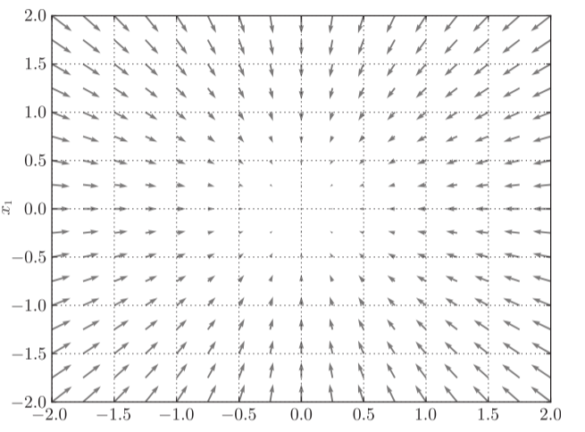

梯度指示的方向是各点处的函数值减小最多的方向

#### 4.4.1 梯度法

梯度法（gradient method），通过不断地沿梯度方向前进，逐渐减小函数值

梯度表示的是各点处的函数值减小最多的方向，指向的是极小值，不一定是最小值

函数的极小值、最小值以及被称为鞍点（saddle point）的地方，梯度为0。

寻找最小值的梯度法称为梯度下降法（gradient descent method）（主要）

寻找最大值的梯度法称为梯度上升法（gradient ascent method）。

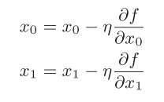 η表示更新量，反复执行，逐渐减小函数值

学习率（learningrate）决定在一次学习中，应该学习多少，以及在多大程度上更新参数。学习率需要事先确定为某个值，比如0.01或0.001，不能过大或过小，一般后续需要调整。

def gradient\_descent(f, init\_x, lr=0.01, step\_num=100):

x = init\_x

for i in range(step\_num):

grad = numerical\_gradient(f, x)

x -= lr \* grad

return x

参数f是要进行最优化的函数，init\_x是初始值，lr是学习率learning rate，step\_num是梯度法的重复次数

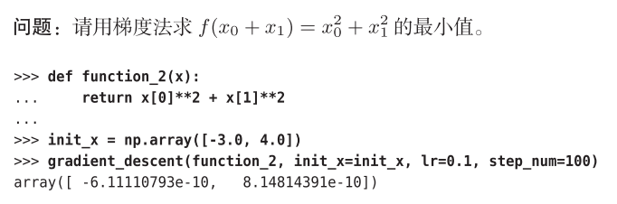

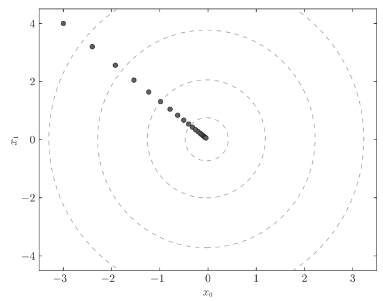

像学习率这样的参数称为超参数，是一种和神经网络的参数（权重和偏置）性质不同的参数。神经网络的权重参数是通过训练数据和学习算法自动获得的，学习率这样的超参数则是人工设定的。超参数需要尝试多个值，以便找到一种可以使学习顺利进行的设定。

#### 4.4.2 神经网络的梯度

神经网络的梯度是指损失函数关于权重参数的梯度，

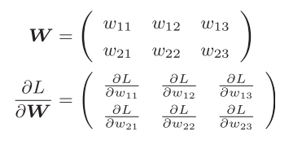权重W的神经网络，损失函数L

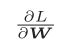的元素由各个元素关于W的偏导数构成，形状和W相同

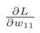表示当w11稍微变化时，损失函数L会发生多大变化

import sys, os

sys.path.append(os.pardir)

import numpy as np

from common.functions import softmax, cross\_entropy\_error

from common.gradient import numerical\_gradient

class simpleNet:

def \_\_init\_\_(self):

self.W = np.random.randn(2,3) # 用高斯分布进行初始化

def predict(self, x):

return np.dot(x, self.W)

def loss(self, x, t):

z = self.predict(x)

y = softmax(z)

loss = cross\_entropy\_error(y, t)

return loss

函数中，x接受输入信号，t接受正确标签

>>> net = simpleNet()

>>> print(net.W) # 权重参数

[[ 0.47355232 0.9977393 0.84668094],

[ 0.85557411 0.03563661 0.69422093]])

>>> x = np.array([0.6, 0.9])

>>> p = net.predict(x)

>>> print(p)

[ 1.05414809 0.63071653 1.1328074]

>>> np.argmax(p) # 最大值的索引

2

>>> t = np.array([0, 0, 1]) # 正确解标签

#求损失

>>> net.loss(x, t)

0.92806853663411326

#求梯度

>>> def f(W):

return net.loss(x, t)

>>> dW = numerical\_gradient(f, net.W)

#输入函数和矩阵（要求这些点的导数）

>>> print(dW)

[[ 0.21924763 0.14356247 -0.36281009]

[ 0.32887144 0.2153437 -0.54421514]]

求出神经网络的梯度后，接下来只需根据梯度法，更新权重参数即可。

## 4.5 学习算法的实现

神经网络的学习步骤如下所示：

随机梯度下降法（stochastic gradient descent，SGD）

前提

神经网络存在合适的权重和偏置，调整权重和偏置以便拟合训练数据的过程称为“学习”。神经网络的学习分成下面4个步骤。

步骤1（mini-batch）

从训练数据中随机选出一部分数据，这部分数据称为mini-batch。我们的目标是减小mini-batch的损失函数的值。

步骤2（计算梯度）

为了减小mini-batch的损失函数的值，需要求出各个权重参数的梯度。梯度表示损失函数的值减小最多的方向。

步骤3（更新参数）

将权重参数沿梯度方向进行微小更新。

步骤4（重复）

重复步骤1、步骤2、步骤3。

#### 4.5.1 2层神经网络的类

```
# coding: utf-8
import sys, os
sys.path.append(os.pardir)  # 为了导入父目录的文件而进行的设定
from common.functions import *
from common.gradient import numerical_gradient

class TwoLayerNet:
    #参数从头开始依次表示输入层的神经元数、隐藏层的神经元数、输出层的神经元数
    def __init__(self, input_size, hidden_size, output_size, weight_init_std=0.01):
        # 初始化权重
        self.params = {}   #字典型变量  键-值对应
        self.params['W1'] = weight_init_std * np.random.randn(input_size, hidden_size)
        self.params['b1'] = np.zeros(hidden_size)
        self.params['W2'] = weight_init_std * np.random.randn(hidden_size, output_size)
        self.params['b2'] = np.zeros(output_size)

    def predict(self, x):     #进行识别（推理） 参数x是图像数据
        W1, W2 = self.params['W1'], self.params['W2']
        b1, b2 = self.params['b1'], self.params['b2']

        a1 = np.dot(x, W1) + b1
        z1 = sigmoid(a1)
        a2 = np.dot(z1, W2) + b2
        y = softmax(a2)

        return y

    # x:输入数据, t:监督数据
    def loss(self, x, t):   #计算损失函数的值。参数x是图像数据，t是正确解标签（后面3个方法的参数也一样）
        y = self.predict(x)

        return cross_entropy_error(y, t)

    def accuracy(self, x, t):   #计算识别精度
        y = self.predict(x)
        y = np.argmax(y, axis=1)
        t = np.argmax(t, axis=1)

        accuracy = np.sum(y == t) / float(x.shape[0])
        return accuracy

    # x:输入数据, t:监督数据
    def numerical_gradient(self, x, t):   #计算梯度
        loss_W = lambda W: self.loss(x, t)

        grads = {}  #字典型变量  键-值对应，调用外部函数计算
        grads['W1'] = numerical_gradient(loss_W, self.params['W1'])
        grads['b1'] = numerical_gradient(loss_W, self.params['b1'])
        grads['W2'] = numerical_gradient(loss_W, self.params['W2'])
        grads['b2'] = numerical_gradient(loss_W, self.params['b2'])

        return grads

	#numerical_gradient()的高速版，将在下一章实现
    def gradient(self, x, t):
        W1, W2 = self.params['W1'], self.params['W2']
        b1, b2 = self.params['b1'], self.params['b2']
        grads = {}

        batch_num = x.shape[0]

        # forward
        a1 = np.dot(x, W1) + b1
        z1 = sigmoid(a1)
        a2 = np.dot(z1, W2) + b2
        y = softmax(a2)

        # backward
        dy = (y - t) / batch_num
        grads['W2'] = np.dot(z1.T, dy)
        grads['b2'] = np.sum(dy, axis=0)

        da1 = np.dot(dy, W2.T)
        dz1 = sigmoid_grad(a1) * da1
        grads['W1'] = np.dot(x.T, dz1)
        grads['b1'] = np.sum(dz1, axis=0)

        return grads
```
params：保存神经网络的参数的字典型变量（实例变量）。

params['W1']是第1层的权重，params['b1']是第1层的偏置。

params['W2']是第2层的权重，params['b2']是第2层的偏置

grads：保存梯度的字典型变量（numerical\_gradient()方法的返回值）。

grads['W1']是第1层权重的梯度，grads['b1']是第1层偏置的梯度。

grads['W2']是第2层权重的梯度，grads['b2']是第2层偏置的梯度

#### 4.5.2 mini-batch的实现

```
# coding: utf-8
import sys, os
sys.path.append(os.pardir)  # 为了导入父目录的文件而进行的设定
import numpy as np
import matplotlib.pyplot as plt
from dataset.mnist import load_mnist
from two_layer_net import TwoLayerNet

# 读入数据
(x_train, t_train), (x_test, t_test) = load_mnist(normalize=True, one_hot_label=True)

network = TwoLayerNet(input_size=784, hidden_size=50, output_size=10)

iters_num = 10000  # 适当设定循环的次数
train_size = x_train.shape[0]
batch_size = 100
learning_rate = 0.1

train_loss_list = []
train_acc_list = []
test_acc_list = []

#epoch是一个单位。一个epoch表示学习中所有训练数据均被使用过一次时的更新次数。
iter_per_epoch = max(train_size / batch_size, 1)

for i in range(iters_num):
    batch_mask = np.random.choice(train_size, batch_size)
    x_batch = x_train[batch_mask]
    t_batch = t_train[batch_mask]

    # 计算梯度
    #grad = network.numerical_gradient(x_batch, t_batch)
    grad = network.gradient(x_batch, t_batch)

    # 更新参数
    for key in ('W1', 'b1', 'W2', 'b2'):
        network.params[key] -= learning_rate * grad[key]

    loss = network.loss(x_batch, t_batch)
    train_loss_list.append(loss)

    if i % iter_per_epoch == 0:
        train_acc = network.accuracy(x_train, t_train)
        test_acc = network.accuracy(x_test, t_test)
        train_acc_list.append(train_acc)
        test_acc_list.append(test_acc)
        print("train acc, test acc | " + str(train_acc) + ", " + str(test_acc))

# 绘制图形
markers = {'train': 'o', 'test': 's'}
x = np.arange(len(train_acc_list))
plt.plot(x, train_acc_list, label='train acc')
plt.plot(x, test_acc_list, label='test acc', linestyle='--')
plt.xlabel("epochs")
plt.ylabel("accuracy")
plt.ylim(0, 1.0)
plt.legend(loc='lower right')
plt.show()
```
mini-batch的大小为100，需要每次从60000个训练数据中随机取出100个数据（图像数据和正确解标签数据）。

然后，对这个包含100笔数据的mini-batch求梯度，使用随机梯度下降法（SGD）更新参数。

这里，梯度法的更新次数（循环的次数）为10000。每更新一次，都对训练数据计算损失函数的值，并把该值添加到数组中。

#### 4.5.3 基于测试数据的评价

神经网络的学习中，必须确认是否能够正确识别训练数据以外的其他数据，即确认是否会发生过拟合。

神经网络学习的最初目标是掌握泛化能力，因此，要评价神经网络的泛化能力，就必须使用不包含在训练数据中的数据。

epoch是一个单位。一个epoch表示学习中所有训练数据均被使用过一次时的更新次数。

```
iter_per_epoch = max(train_size / batch_size, 1)
...
if i % iter_per_epoch == 0:
        train_acc = network.accuracy(x_train, t_train)
        test_acc = network.accuracy(x_test, t_test)
        train_acc_list.append(train_acc)
        test_acc_list.append(test_acc)
        print("train acc, test acc | " + str(train_acc) + ", " + str(test_acc))
```
