## 5.1 计算图

图形是数据结构图，通过多个节点和边表示（连接节点的直线称为“边”

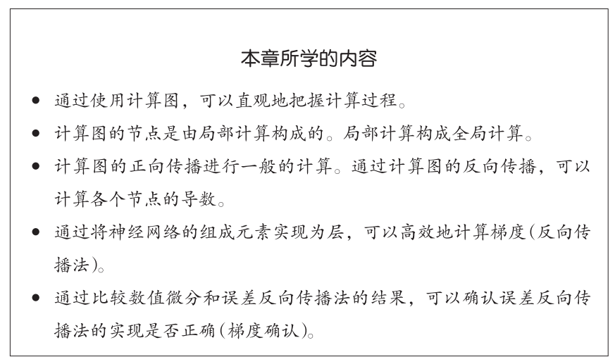

#### 5.1.1 用计算图求解

问题1： 太郎在超市买了2个100日元一个的苹果，消费税是10%，请计算支付金额。

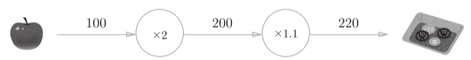

问题2： 太郎在超市买了2个苹果、3个橘子。其中，苹果每个100日元，橘子每个150日元。消费税是10%，请计算支付金额。

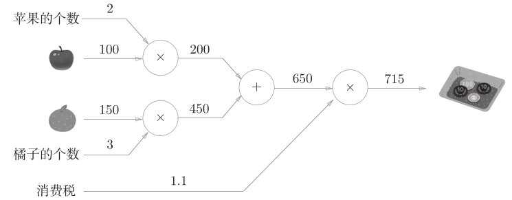

综上，用计算图解题的情况下，需要按如下流程进行。

1. 构建计算图。
2. 在计算图上，从左向右进行计算。

“从左向右进行计算”是一种正方向上的传播，简称为正向传播（forward propagation）。正向传播是从计算图出发点到结束点的传播。

从右向左进行计算”称为反向传播（backward propagation）

#### 5.1.2 局部计算

计算图的特征是可以通过传递“局部计算”获得最终结果。

无论全局的计算有多么复杂，各个步骤所要做的就是对象节点的局部计算。

我觉得：大事化小，小事化了

#### 5.1.3 为何用计算图解题

1. 无论全局是多么复杂的计算，都可以通过局部计算使各个节点致力于简单的计算，从而简化问题。
2. 利用计算图可以将中间的计算结果全部保存起来
3. 可以通过正向传播和反向传播高效地计算各个变量的导数值。

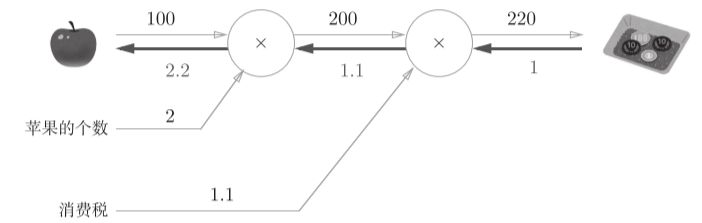

反向传播传递“局部导数”，将导数的值写在箭头的下方。

## 5.2 链式法则

#### 5.2.1 计算图的反向传播

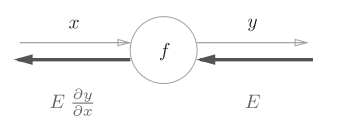设存在y = f(x)的计算

反向传播的计算顺序：将信号E乘以节点的局部导数（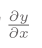），然后将结果传递给下一个节点。

#### 5.2.2 什么是链式法则

链式法是关于复合函数的导数的性质，定义如下。

如果某个函数由复合函数表示，则该复合函数的导数可以用构成复合函数的各个函数的导数的乘积表示。

z = (x + y)2为：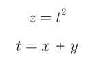，则有：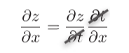

#### 5.2.3 链式法则和计算图

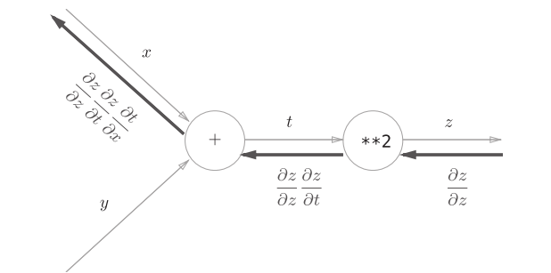t=(x+y)

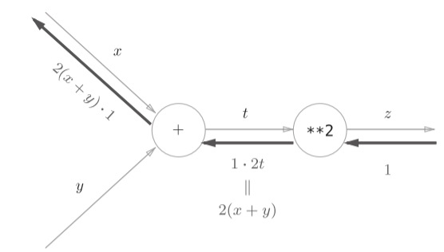

注意：从右往左每次结果 = 上次结果 \* 导数 （不要忘记上次结果）

## 5.3 反向传播

加法节点的反向传播：eg. z = x + y：

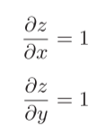 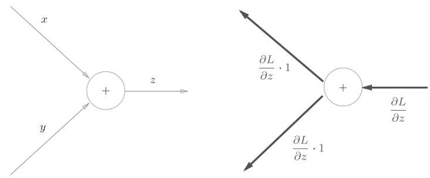

L是从上游传来的

具体实例：5+10=15，上游传来1.3

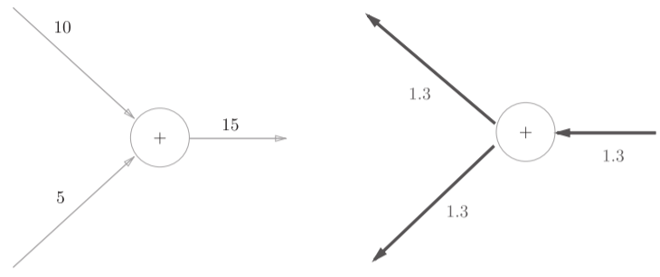

加法节点的反向传播只是将输入信号输出到下一个节点

#### 5.3.2 乘法节点的反向传播

z=xy：

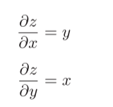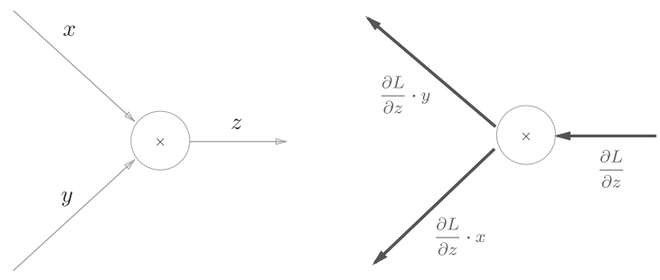

具体实例：5\*10=50，上游传来1.3

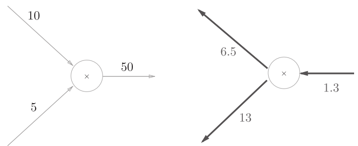

乘法的反向传播需要正向传播时的输入信号值。

因此，实现乘法节点的反向传播时，要保存正向传播的输入信号。

#### 5.3.3 苹果的例子

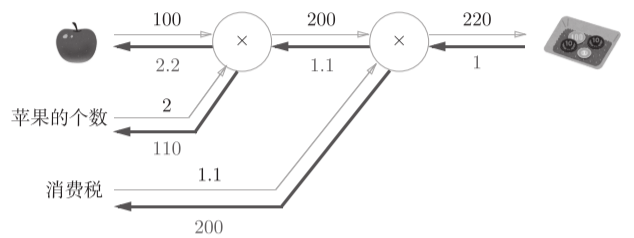

1.1=1\*1.1

200=1\*200

2.2=1.1\*2

110=1.1\*100

## 5.4 简单层的实现

#### 5.4.1 乘法层的实现

```
class MulLayer:
    def __init__(self):
        self.x = None
        self.y = None

    def forward(self, x, y):
        self.x = x
        self.y = y
        out = x * y

        return out

    def backward(self, dout):
        dx = dout * self.y
        dy = dout * self.x

        return dx, dy
```
backward()将从上游传来的导数（dout）乘以正向传播的翻转值，然后传给下游。

```
apple = 100
apple_num = 2
tax = 1.1

mul_apple_layer = MulLayer()
mul_tax_layer = MulLayer()

# forward
apple_price = mul_apple_layer.forward(apple, apple_num)
price = mul_tax_layer.forward(apple_price, tax)

# backward
dprice = 1
dapple_price, dtax = mul_tax_layer.backward(dprice)
dapple, dapple_num = mul_apple_layer.backward(dapple_price)

print("price:", int(price))
print("dApple:", dapple)
print("dApple_num:", int(dapple_num))
print("dTax:", dtax)
```
backward()的参数中需要输入“关于正向传播时的输出变量的导数”

可以把layer看作一个节点：所以只计算两个节点前后值就都算出来了

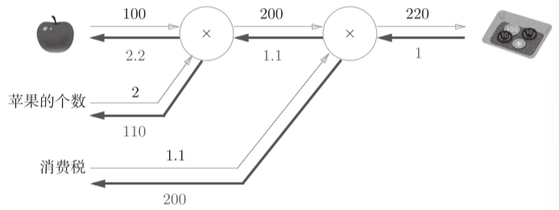

#### 5.4.2 加法层的实现

```
class AddLayer:
    def __init__(self):
        pass

    def forward(self, x, y):
        out = x + y

        return out

    def backward(self, dout):
        dx = dout * 1
        dy = dout * 1

        return dx, dy
```
## 5.5 激活函数层的实现

#### 5.5.1 ReLU层

激活函数ReLU（Rectified Linear Unit）：

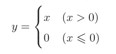，求导：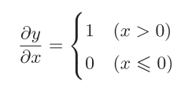

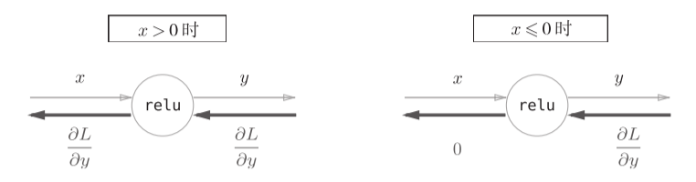

class Relu:

def \_\_init\_\_(self):

self.mask = None

def forward(self, x):

self.mask = (x <= 0)

out = x.copy()

out[self.mask] = 0

return out

def backward(self, dout):

dout[self.mask] = 0

dx = dout

return dx

Relu类有实例变量mask：由True/False构成的NumPy数组

self.mask = (x <= 0) 会把正向传播时的输入x的元素中小于等于0的地方保存为True，其他地方（大于0的元素）保存为False。

#### 5.5.2 Sigmoid层

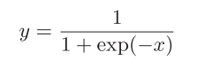

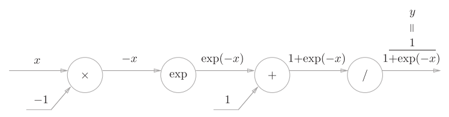

“exp”节点会进行y = exp(x)的计算，“/”节点会进行 的计算。

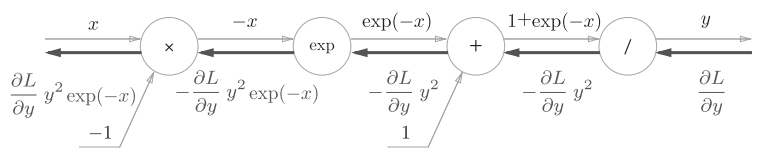

简化为：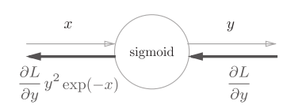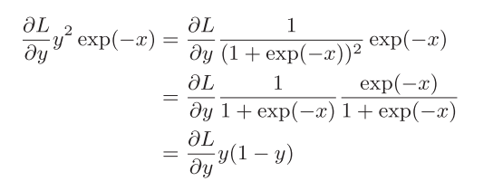

进一步简化：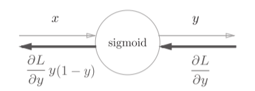

class Sigmoid:

def \_\_init\_\_(self):

self.out = None

def forward(self, x):

out = 1 / (1 + np.exp(-x))

self.out = out

return out

def backward(self, dout):

dx = dout \* (1.0 - self.out) \* self.out

return dx

## 5.6 Affine/Softmax层的实现

#### 5.6.1 Affine层

神经网络的正向传播中进行的矩阵的乘积运算在几何学领域被称为“仿射变换”。因此，这里将进行仿射变换的处理实现为“Affine层”。

X = np.random.rand(2) # 输入 一维矩阵
W = np.random.rand(2,3) # 权重 二维矩阵
B = np.random.rand(3) # 偏置 一维矩阵

X.shape # (2,)
W.shape # (2, 3)
B.shape # (3,)

Y = np.dot(X, W) + B

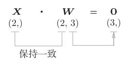矩阵相乘，第一个矩阵列数=第二个矩阵行数

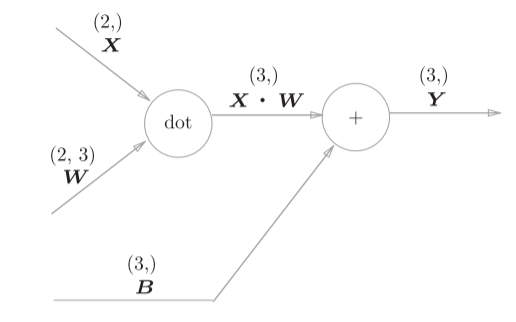

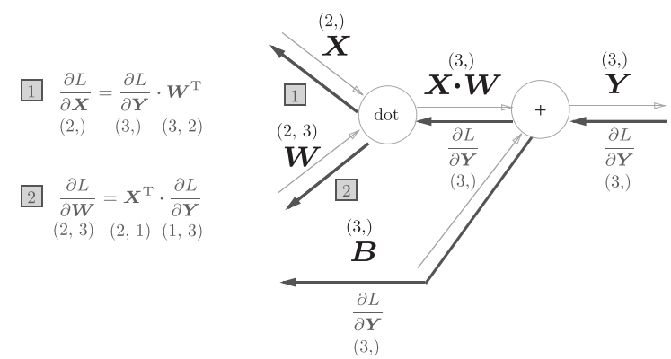

#### 5.6.2 批版本的Affine层

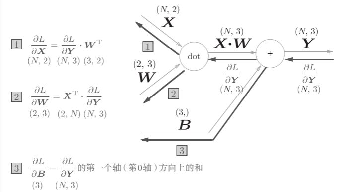

正向传播时，偏置会被加到每一个数据（第1个、第2个……）上

反向传播时，各个数据的反向传播的值需要汇总为偏置的元素

>>> dY = np.array([[1, 2, 3,], [4, 5, 6]])

>>> dY

array([[1, 2, 3], [4, 5, 6]])

>>>

>>> dB = np.sum(dY, axis=0)

>>> dB

array([5, 7, 9])

np.sum()对第0轴（以数据为单位的轴，axis=0）方向上的元素进行求和。

class Affine:

def \_\_init\_\_(self, W, b):

self.W = W

self.b = b

self.x = None

self.dW = None

self.db = None

def forward(self, x):

self.x = x

out = np.dot(x, self.W) + self.b

return out

def backward(self, dout):

dx = np.dot(dout, self.W.T)

self.dW = np.dot(self.x.T, dout)

self.db = np.sum(dout, axis=0)

return dx

#### 5.6.3 Softmax-with-Loss 层

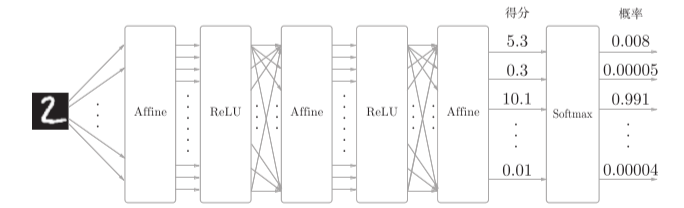

Softmax层将输入值正规化（将输出值的和调整为1）之后再输出。

当神经网络的推理只需要给出一个答案的情况下，因为此时只对得分最大值感兴趣，所以不需要Softmax层。不过，神经网络的学习阶段则需要Softmax层。

Softmax-with-Loss层（Softmax函数和交叉熵误差）的计算图如图：

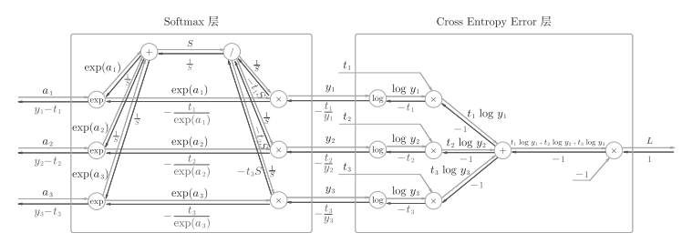

简化为：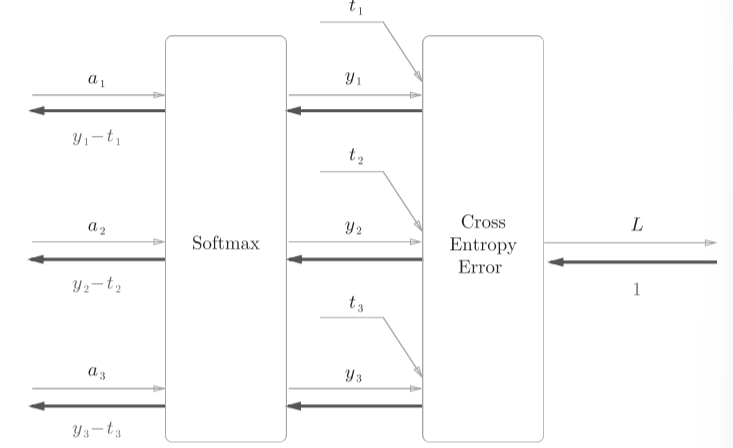

（y,y2,y3）是Softmax层的输出，（t1,t2,t3）是监督数据，所以（y1− t1,y2 −t2,y3 − t3）是Softmax层的输出和教师标签的差分。

神经网络学习的目的就是通过调整权重参数，使神经网络的输出（Softmax的输出）接近教师标签，必须将神经网络的输出与教师标签的误差高效地传递给前面的层。

神经网络的反向传播会把这个差分表示的误差传递给前面的层，这是神经网络学习中的重要性质。

* 分类问题使用交叉熵误差作为softmax函数的损失函数后，反向传播得到（y1 − t1, y2 − t2, y3 − t3）这样 “漂亮”的结果。
* 回归问题中输出层使用“恒等函数”，损失函数使用“平方和误差”，反向传播才能得到（y1−t1, y2 − t2, y3 − t3）这样“漂亮”的结果。

class SoftmaxWithLoss:

def \_\_init\_\_(self):

self.loss = None # 损失

self.y = None

# softmax的输出

self.t = None

# 监督数据（one-hot vector）

def forward(self, x, t):

self.t = t

self.y = softmax(x)

self.loss = cross\_entropy\_error(self.y, self.t)

return self.loss

def backward(self, dout=1):

batch\_size = self.t.shape[0]

dx = (self.y - self.t) / batch\_size

return dx

## 5.7 误差反向传播法的实现

#### 5.7.1 神经网络学习的全貌图

神经网络学习的步骤如下所示。

前提

神经网络中有合适的权重和偏置，调整权重和偏置以便拟合训练数据的

过程称为学习。神经网络的学习分为下面4个步骤。

步骤1（mini-batch）

从训练数据中随机选择一部分数据。

步骤2（计算梯度）

计算损失函数关于各个权重参数的梯度。

步骤3（更新参数）

将权重参数沿梯度方向进行微小的更新。

步骤4（重复）

重复步骤1、步骤2、步骤3。

#### 5.7.2 对应误差反向传播法的神经网络的实现

```
# coding: utf-8
import sys, os
sys.path.append(os.pardir)  # 为了导入父目录的文件而进行的设定
import numpy as np
from common.layers import *
from common.gradient import numerical_gradient
from collections import OrderedDict

class TwoLayerNet:

    def __init__(self, input_size, hidden_size, output_size, weight_init_std = 0.01):
        # 初始化权重
        self.params = {}
        self.params['W1'] = weight_init_std * np.random.randn(input_size, hidden_size)
        self.params['b1'] = np.zeros(hidden_size)
        self.params['W2'] = weight_init_std * np.random.randn(hidden_size, output_size)
        self.params['b2'] = np.zeros(output_size)

        # 生成层
        #OrderedDict是有序字典，它可以记住向字典里添加元素的顺序。
        self.layers = OrderedDict()
        self.layers['Affine1'] = Affine(self.params['W1'], self.params['b1'])
        self.layers['Relu1'] = Relu()
        self.layers['Affine2'] = Affine(self.params['W2'], self.params['b2'])

        self.lastLayer = SoftmaxWithLoss()

    def predict(self, x):
        for layer in self.layers.values():
            x = layer.forward(x)

        return x

    # x:输入数据, t:监督数据
    def loss(self, x, t):
        y = self.predict(x)
        return self.lastLayer.forward(y, t)

    def accuracy(self, x, t):
        y = self.predict(x)
        y = np.argmax(y, axis=1)
        if t.ndim != 1 : t = np.argmax(t, axis=1)

        accuracy = np.sum(y == t) / float(x.shape[0])
        return accuracy

    # x:输入数据, t:监督数据
    def numerical_gradient(self, x, t):
        loss_W = lambda W: self.loss(x, t)

        grads = {}
        grads['W1'] = numerical_gradient(loss_W, self.params['W1'])
        grads['b1'] = numerical_gradient(loss_W, self.params['b1'])
        grads['W2'] = numerical_gradient(loss_W, self.params['W2'])
        grads['b2'] = numerical_gradient(loss_W, self.params['b2'])

        return grads

    def gradient(self, x, t):
        # forward
        self.loss(x, t)

        # backward
        dout = 1
        dout = self.lastLayer.backward(dout)

        layers = list(self.layers.values())
        layers.reverse()
        for layer in layers:
            dout = layer.backward(dout)

        # 设定
        grads = {}
        grads['W1'], grads['b1'] = self.layers['Affine1'].dW, self.layers['Affine1'].db
        grads['W2'], grads['b2'] = self.layers['Affine2'].dW, self.layers['Affine2'].db

        return grads
```
由于OrderedDict可以记住向字典里添加元素的顺序。神经网络的正向传播只需按照添加元素的顺序调用各层的forward()方法就可以完成处理，而反向传播只需要按照相反的顺序调用各层即可。

#### 5.7.3 误差反向传播法的梯度确认

* 数值微分的计算简单，但很耗费时间，在确认误差反向传播法的实现是否正确时用数值微分。
* 误差反向传播法的实现很复杂，容易出错。但即使存在大量的参数，也可以高效地计算梯度。

确认数值微分求出的梯度结果和误差反向传播法求出的结果是否一致（严格地讲，是非常相近）的操作称为梯度确认（gradient check）

```
# coding: utf-8
import sys, os
sys.path.append(os.pardir)  # 为了导入父目录的文件而进行的设定
import numpy as np
from dataset.mnist import load_mnist
from two_layer_net import TwoLayerNet

# 读入数据
(x_train, t_train), (x_test, t_test) = load_mnist(normalize=True, one_hot_label=True)

network = TwoLayerNet(input_size=784, hidden_size=50, output_size=10)

x_batch = x_train[:3]
t_batch = t_train[:3]

grad_numerical = network.numerical_gradient(x_batch, t_batch)
grad_backprop = network.gradient(x_batch, t_batch)

for key in grad_numerical.keys():
    diff = np.average( np.abs(grad_backprop[key] - grad_numerical[key]) )
    print(key + ":" + str(diff))

#运行结果非常小
# b1:9.70418809871e-13
# W2:8.41139039497e-13
# b2:1.1945999745e-10
# W1:2.2232446644e-13
```
#### 5.7.4 使用误差反向传播法的学习

```
# coding: utf-8
import sys, os
sys.path.append(os.pardir)

import numpy as np
from dataset.mnist import load_mnist
from two_layer_net import TwoLayerNet

# 读入数据
(x_train, t_train), (x_test, t_test) = load_mnist(normalize=True, one_hot_label=True)

network = TwoLayerNet(input_size=784, hidden_size=50, output_size=10)

iters_num = 10000
train_size = x_train.shape[0]
batch_size = 100
learning_rate = 0.1

train_loss_list = []
train_acc_list = []
test_acc_list = []

iter_per_epoch = max(train_size / batch_size, 1)

for i in range(iters_num):
    batch_mask = np.random.choice(train_size, batch_size)
    x_batch = x_train[batch_mask]
    t_batch = t_train[batch_mask]

    # 梯度
    #grad = network.numerical_gradient(x_batch, t_batch)
    grad = network.gradient(x_batch, t_batch)

    # 更新
    for key in ('W1', 'b1', 'W2', 'b2'):
        network.params[key] -= learning_rate * grad[key]

    loss = network.loss(x_batch, t_batch)
    train_loss_list.append(loss)

    if i % iter_per_epoch == 0:
        train_acc = network.accuracy(x_train, t_train)
        test_acc = network.accuracy(x_test, t_test)
        train_acc_list.append(train_acc)
        test_acc_list.append(test_acc)
        print(train_acc, test_acc)
```
