神经网络的学习的目的是找到使损失函数的值尽可能小的参数。

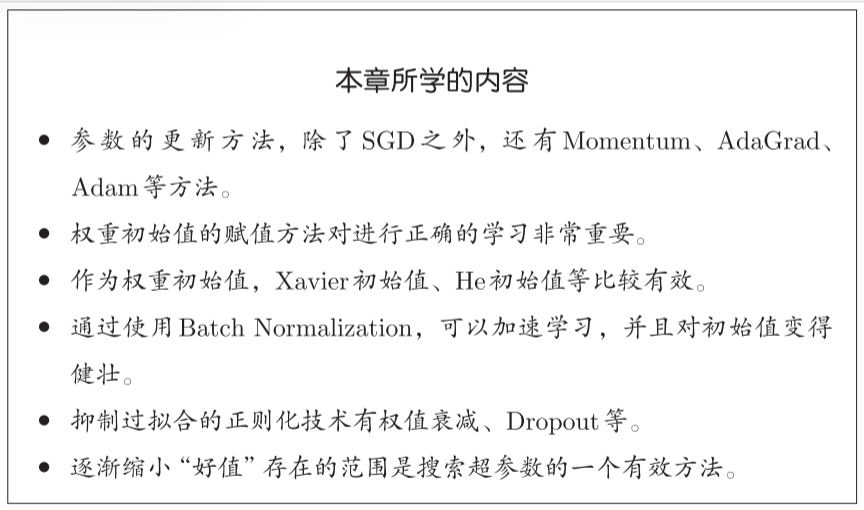

## 6.1 参数的更新

解决寻找最优参数的问题的过程称为最优化（optimization）

随机梯度下降法（stochastic gradient descent, SGD）：将参数的梯度（导数）作为了线索。使用参数的梯度，沿梯度方向更新参数，并重复这个步骤多次，从而逐渐靠近最优参数

#### 6.1.2 SGD

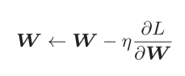, '←'表示用右边的值更新左边的值。

需要更新的权重参数记为W，把损失函数关于W的梯度记为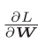 ，η表示学习率

class SGD:

def \_\_init\_\_(self, lr=0.01):

self.lr = lr #学习率

def update(self, params, grads):

for key in params.keys():

params[key] -= self.lr \* grads[key]

使用SGD更新参数：

network = TwoLayerNet(...)

optimizer = SGD()

for i in range(10000):

...

x\_batch, t\_batch = get\_mini\_batch(...) # mini-batch

grads = network.gradient(x\_batch, t\_batch)

params = network.params

optimizer.update(params, grads)

...

#### 6.1.3 SGD的缺点

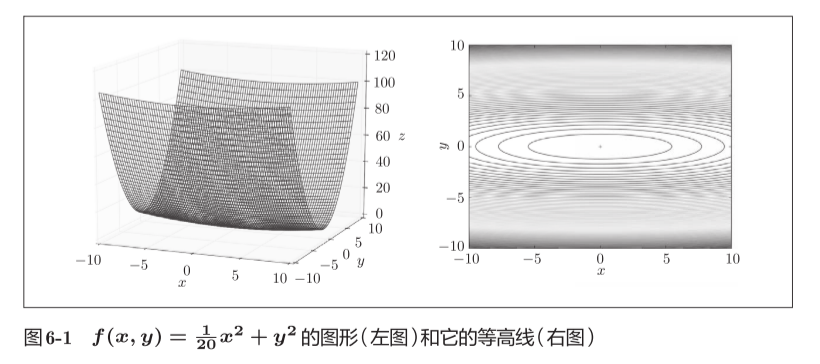

梯度：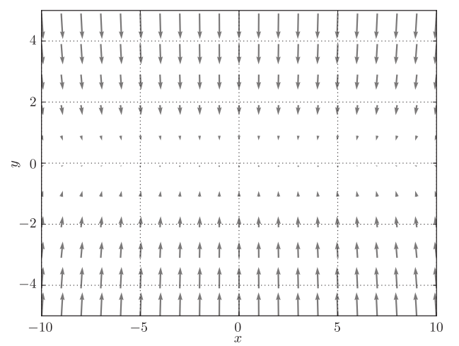

y轴方向的坡度大，而x轴方向的坡度小，虽然函数最小值在(x, y) = (0, 0)处，但是图中的梯度在很多地方并没有指向(0, 0)。

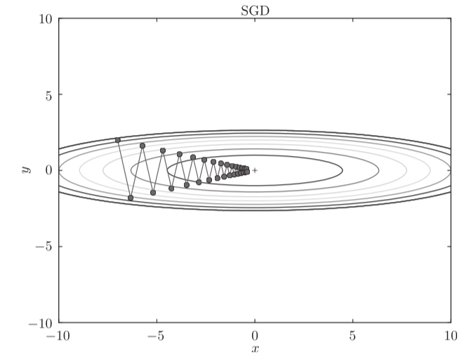

SGD呈“之”字形移动。这是一个相当低效的路径。

SGD的缺点：如果函数的形状非均向（anisotropic），比如呈延伸状，搜索的路径就会非常低效。

SGD低效的根本原因是，梯度的方向并没有指向最小值的方向。

#### 6.1.4 Momentum动量

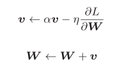，变量v，对应物理上的速度

物体在梯度方向上受力，在这个力的作用下，物体的速度增加

在物体不受任何力时，αv 承担使物体逐渐减速的任务（α设定为0.9之类的值），对应物理上的地面摩擦或空气阻力

```
class Momentum:

    """Momentum SGD"""

    def __init__(self, lr=0.01, momentum=0.9):
        self.lr = lr
        self.momentum = momentum
        self.v = None

    def update(self, params, grads):
        if self.v is None:
            self.v = {}
            for key, val in params.items():
                self.v[key] = np.zeros_like(val)

        for key in params.keys():
            self.v[key] = self.momentum*self.v[key] - self.lr*grads[key]
            params[key] += self.v[key]
```
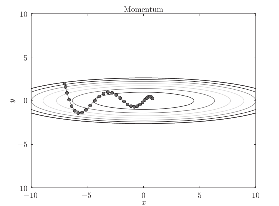减弱“之”字形

y轴方向上受到的力很大，但是因为交互地受到正方向和反方向的力，会互相抵消，所以y轴方向上的速度不稳定

虽然x轴方向上受到的力非常小，但是一直在同一方向上受力，所以朝同一个方向会有一定的加速

#### 6.1.5 AdaGrad

学习率衰减（learning rate decay）的方法，即随着学习的进行，使学习率逐渐减小。逐渐减小学习率的想法，相当于将“全体”参数的学习率值一起降低。

而AdaGrad会为参数的每个元素适当地调整学习率

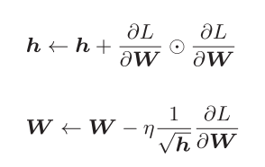

h 保存了以前的所有梯度值的平方和（表示对应矩阵元素的乘法）

在更新参数时，通过乘以 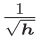，就可以调整学习的尺度。

参数的元素中变动较大（被大幅更新）的元素的学习率将变小，

即变化较大的元素（h较大，较小）对应学习率变小

```
class AdaGrad:

    """AdaGrad"""

    def __init__(self, lr=0.01):
        self.lr = lr
        self.h = None

    def update(self, params, grads):
        if self.h is None:
            self.h = {}
            for key, val in params.items():
                self.h[key] = np.zeros_like(val)

        for key in params.keys():
            self.h[key] += grads[key] * grads[key]
            params[key] -= self.lr * grads[key] / (np.sqrt(self.h[key]) + 1e-7)
```
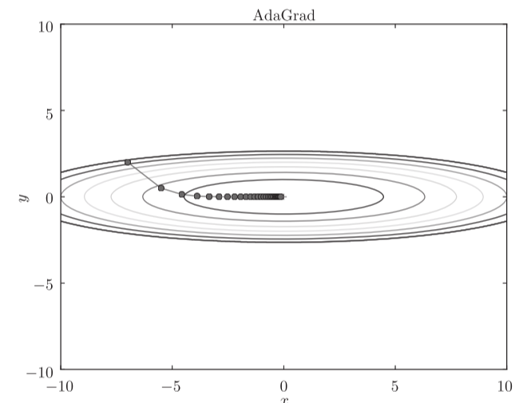

函数的取值高效地向着最小值移动。

由于y轴方向上的梯度较大，因此刚开始变动较大，但是后面会根据这个较大的变动按比例进行调整，减小更新的步伐。

因此，y轴方向上的更新程度被减弱，“之”字形的变动程度有所衰减。

#### 6.1.6 Adam

Adam融合了Momentum和AdaGrad的方法，可进行超参数的“偏置校正”

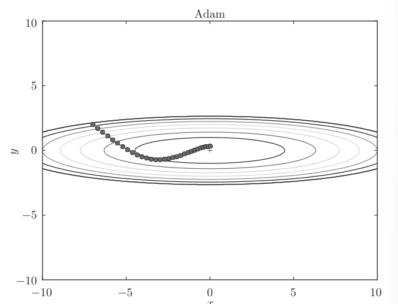

```
class Adam:

    """Adam (http://arxiv.org/abs/1412.6980v8)"""

    def __init__(self, lr=0.001, beta1=0.9, beta2=0.999):
        self.lr = lr
        self.beta1 = beta1
        self.beta2 = beta2
        self.iter = 0
        self.m = None
        self.v = None

    def update(self, params, grads):
        if self.m is None:
            self.m, self.v = {}, {}
            for key, val in params.items():
                self.m[key] = np.zeros_like(val)
                self.v[key] = np.zeros_like(val)

        self.iter += 1
        lr_t  = self.lr * np.sqrt(1.0 - self.beta2**self.iter) / (1.0 - self.beta1**self.iter)

        for key in params.keys():
            #self.m[key] = self.beta1*self.m[key] + (1-self.beta1)*grads[key]
            #self.v[key] = self.beta2*self.v[key] + (1-self.beta2)*(grads[key]**2)
            self.m[key] += (1 - self.beta1) * (grads[key] - self.m[key])
            self.v[key] += (1 - self.beta2) * (grads[key]**2 - self.v[key])

            params[key] -= lr_t * self.m[key] / (np.sqrt(self.v[key]) + 1e-7)

            #unbias_m += (1 - self.beta1) * (grads[key] - self.m[key]) # correct bias
            #unbisa_b += (1 - self.beta2) * (grads[key]*grads[key] - self.v[key]) # correct bias
            #params[key] += self.lr * unbias_m / (np.sqrt(unbisa_b) + 1e-7)
```
Adam会设置3个超参数。一个是学习率（论文中以α出现），另外两个是一次momentum系数β1和二次momentum系数β2。

#### 6.1.7 使用哪种更新方法呢

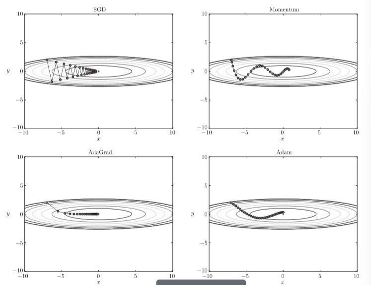

#### 6.1.8 基于MNIST数据集的更新方法的比较

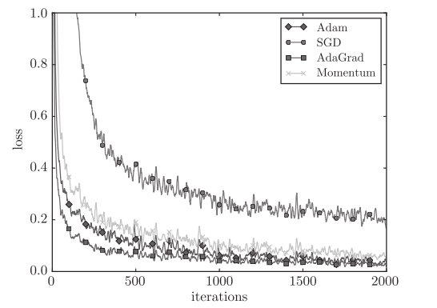

横轴表示学习的迭代次数（iteration），纵轴表示损失函数的值（loss）

实验结果会随学习率等超参数、神经网络的结构（几层深等）的不同而发生变化。一般而言，与SGD相比，其他3种方法可以学习得更快，有时最终的识别精度也更高。

## 6.2 权重的初始值

#### 6.2 权重的初始值

权值衰减（weight decay）是一种以减小权重参数的值为目的进行学习的方法。通过减小权重参数的值来抑制过拟合的发生。所以初始值要设小

但初始值不能设为0，因为正向传播时如果权重为0，则神经元都会传递相同值，反向传播时也只有相同的更新

#### 6.2.2 隐藏层的激活值的分布

1. 标准差为1的高斯分布

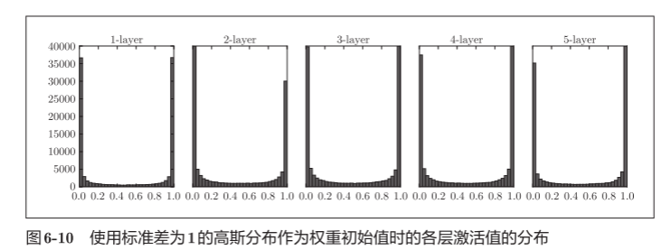

各层的激活值呈偏向0和1的分布，偏向0和1的数据分布会造成反向传播中梯度的值不断变小，最后消失。这个问题称为梯度消失（gradient vanishing）。

2. 标准差为0.01的高斯分布

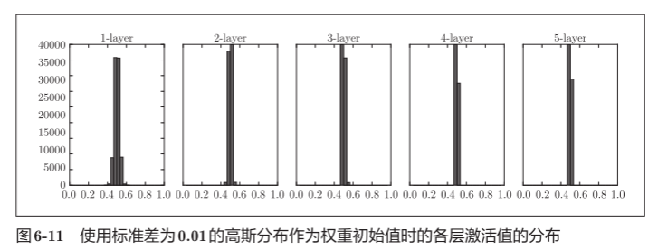

呈集中在0.5附近的分布。都是类似输出，激活值在分布上有所偏向会出现“表现力受限”的问题。

3. Xavier初始值 √

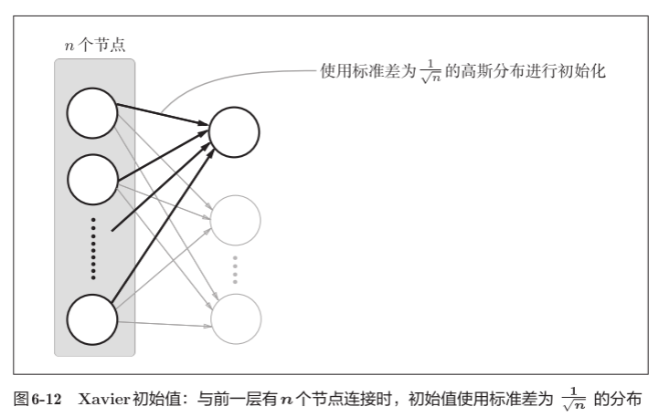

使用Xavier初始值后，前一层的节点数越多，要设定为目标节点的初始值的权重尺度就越小。

node\_num = 100 # 前一层的节点数

w = np.random.randn(node\_num, node\_num) / np.sqrt(node\_num)

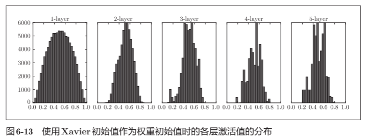

越是后面的层，图像变得越歪斜，但是呈现了比之前更有广度的分布。

#### 6.2.3 ReLU的权重初始值

Xavier初始值是以激活函数是线性函数为前提而推导出来的。

当激活函数使用ReLU时，一般使用“He初始值”，当前一层的节点数为n时，He初始值使用标准差为 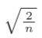 的高斯分布。

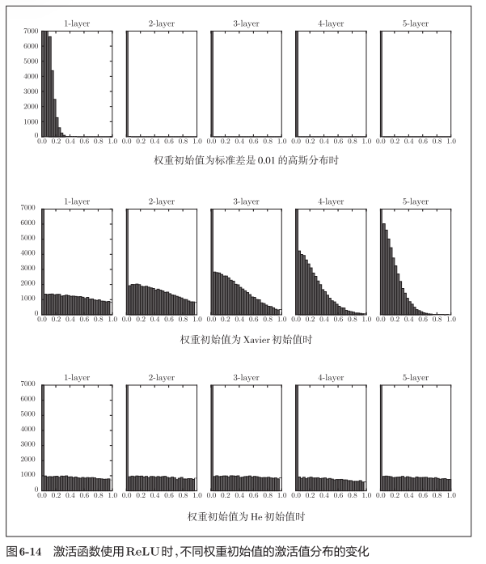

当激活函数使用ReLU时，权重初始值使用He初始值，

当激活函数为sigmoid或tanh等S型曲线函数时，初始值使用Xavier初始值。

#### 6.2.4 基于MNIST数据集的权重初始值的比较

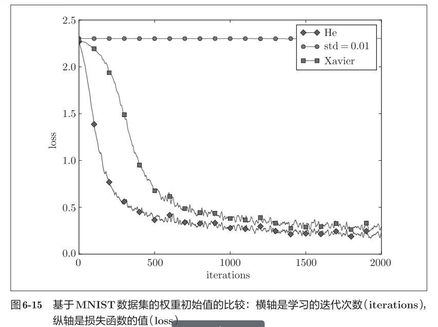

He初始值时的学习进度更快一些

在神经网络的学习中，权重初始值非常重要。

## 6.3 Batch Normalization，Batch Norm

Batch Norm的思路是调整各层的激活值分布使其拥有适当的广度。

#### 6.3.1 Batch Normalization 的算法

优点：

1. 可以使学习快速进行（可以增大学习率）。
2. 不那么依赖初始值（对于初始值不用那么神经质）。
3. 抑制过拟合（降低Dropout等的必要性）。

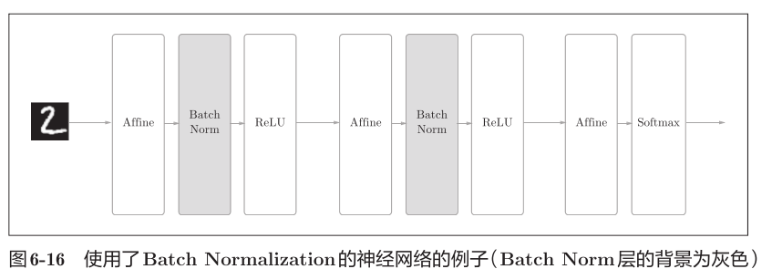

Batch Norm，以进行学习时的mini-batch为单位，按mini-batch进行正规化。进行使数据分布的均值为0、方差为1的正规化。通过将这个处理插入到激活函数的前面（或者后面），可以减小数据分布的偏向。

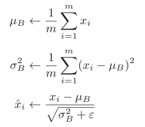

对mini-batch的m个输入数据的集合B = {x1,x2, ... ,xm}求均值和方差 。

然后对输入数据进行均值为0、方差为1（合适的分布）的正规化。

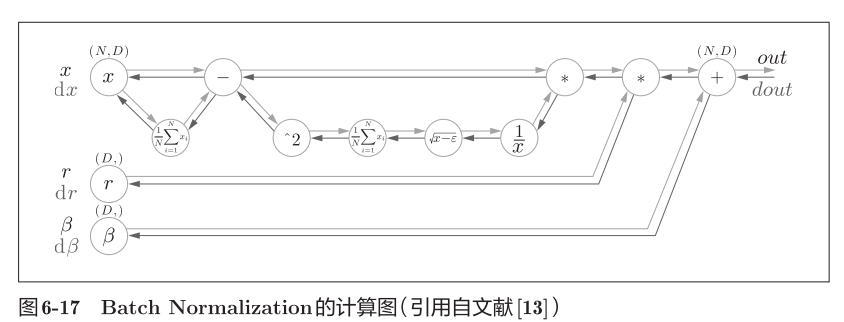

#### 6.3.2 Batch Normalization的评估

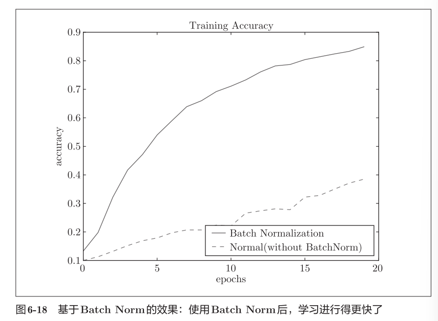

通过使用Batch Norm，可以推动学习的进行。并且，对权重初始值变得健壮（“对初始值健壮”表示不那么依赖初始值）。

## 6.4 正则化

过拟合指的是只能拟合训练数据，但不能很好地拟合不包含在训练数据中的其他数据的状态。机器学习的目标是提高泛化能力，即便是没有包含在训练数据里的未观测数据，也希望模型可以进行正确的识别。

#### 6.4.1 过拟合

发生过拟合的原因，主要有以下两个。

1. 模型拥有大量参数、表现力强。
2. 训练数据少。

减少训练数据测试：

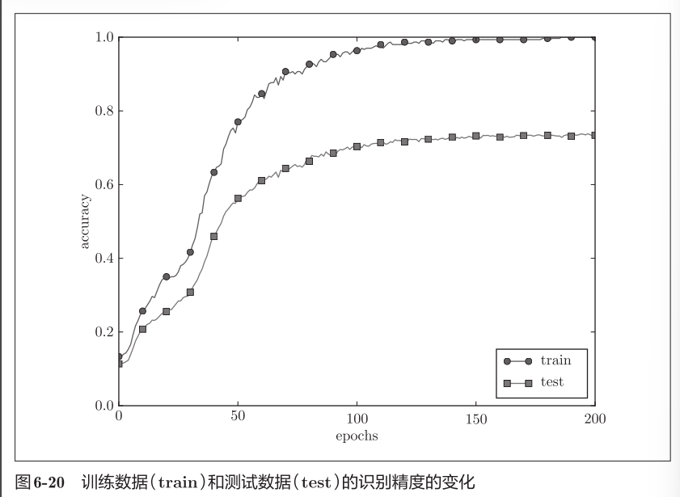

模型对训练时没有使用的一般数据（测试数据）拟合得不是很好。

#### 6.4.2 权值衰减

很多过拟合原本就是因为权重参数取值过大才发生的。

权值衰减通过在学习的过程中对大的权重进行惩罚，来抑制过拟合。

1. L2范数相当于各个元素的平方和。用数学式表示的话，假设有权重W= (w1,w2, ... ,wn)，则L2范数可用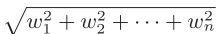计算
2. L1范数是各个元素的绝对值之和，相当于|w1| + |w2| + ... + |wn|。
3. L∞范数也称为Max范数，相当于各个元素的绝对值中最大的那一个。

L2范数、L1范数、L∞范数都可以用作正则化项。

神经网络的学习目的是减小损失函数的值。损失函数加上权重的平方范数（L2范数），就可以抑制权重变大。

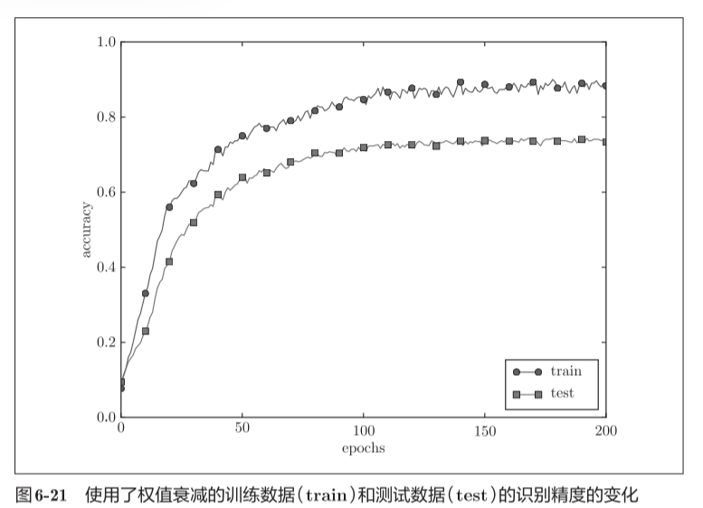

差距减小

#### 6.4.3 Dropout

如果网络的模型变得很复杂，只用权值衰减就难以应对了。

Dropout是一种在学习的过程中随机删除神经元的方法。

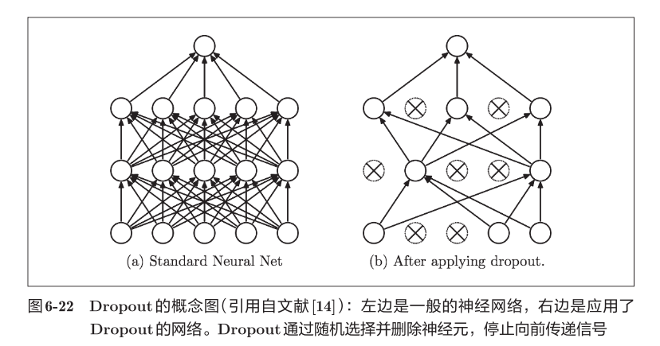

训练时，随机选出隐藏层的神经元，然后将其删除。被删除的神经元不再进行信号的传递，训练时，每传递一次数据，就会随机选择要删除的神经元。

测试时，虽然会传递所有的神经元信号，但是对于各个神经元的输出，要乘上训练时的删除比例后再输出

class Dropout:

def \_\_init\_\_(self, dropout\_ratio=0.5):

self.dropout\_ratio = dropout\_ratio

self.mask = None

#self.mask中都会以False的形式保存要删除的神经元。

def forward(self, x, train\_flg=True):

if train\_flg:

#将随机值比dropout\_ratio大的元素设为True。

self.mask = np.random.rand(\*x.shape) > self.dropout\_ratio

return x \* self.mask

else:

return x \* (1.0 - self.dropout\_ratio)

def backward(self, dout):

return dout \* self.mask

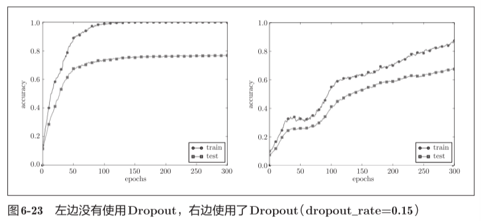

使用Dropout，训练数据和测试数据的识别精度的差距变小了。

集成学习，就是让多个模型单独进行学习，推理时再取多个模型的输出的平均值。进行集成学习，神经网络的识别精度可以提高好几个百分点。

Dropout通过在学习过程中随机删除神经元，从而每一次都让不同的模型进行学习。相当于模拟实现了集成学习。

## 6.5 超参数的验证

超参数是指，比如各层的神经元数量、batch大小、参数更新时的学习率或权值衰减等。如果这些超参数没有设置合适的值，模型的性能就会很差。

#### 6.5.1 验证数据

不能使用测试数据评估超参数的性能，如果使用，会导致超参数对测试数据过拟合，影响泛化能力

调整超参数时，必须使用超参数专用的确认数据：验证数据（validation data）评估超参数的好坏。

训练数据用于参数（权重和偏置）的学习，验证数据用于超参数的性能评估。为了确认泛化能力，要在最后使用（比较理想的是只用一次）测试数据。

验证数据可以从训练数据中事先分割20%

#### 6.5.2 超参数的最优化

进行超参数的最优化时，逐渐缩小超参数的“好值”的存在范围非常重要。

一开始先大致设定一个范围，从这个范围中随机选出一个超参数（采样），用这个采样到的值进行识别精度的评估；然后，多次重复该操作，观察识别精度的结果，根据这个结果缩小超参数的“好值”的范围。通过重复这一操作，就可以逐渐确定超参数的合适范围。

（在进行神经网络的超参数的最优化时，与网格搜索等有规律的搜索相比，随机采样的搜索方式效果更好。这是因为在多个超参数中，各个超参数对最终的识别精度的影响程度不同。）

步骤0

设定超参数的范围。

步骤1

从设定的超参数范围中随机采样。

步骤2

使用步骤1中采样到的超参数的值进行学习，通过验证数据评估识别精度（但是要将epoch设置得很小）。

步骤3

重复步骤1和步骤2（100次等），根据它们的识别精度的结果，缩小超参数的范围。

在缩小到一定程度时，从该范围中选出一个超参数的值。

