卷积神经网络（Convolutional Neural Network，CNN）。

CNN被用于图像识别、语音识别等各种场合，在图像识别的比赛中，基于深度学习的方法几乎都以CNN为基础。

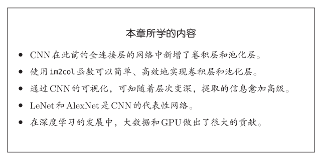

## 7.1 整体结构

相邻层的所有神经元之间都有连接，这称为全连接（fully-connected）。

可以用Affine层实现了全连接层：

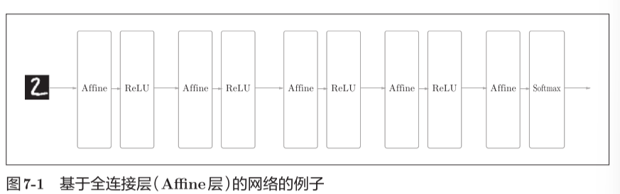

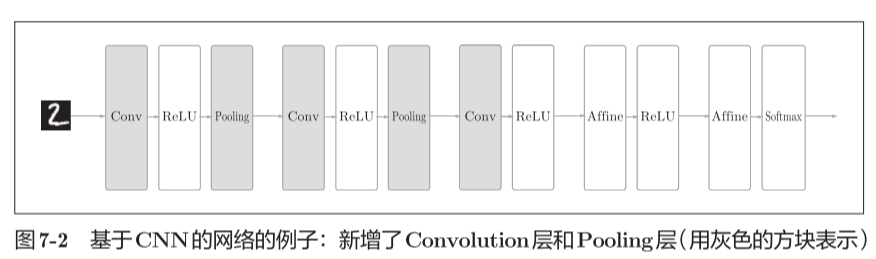

CNN中新增了Convolution卷积层和Pooling池化层。

CNN的层的连接顺序是“Convolution - ReLU -（Pooling）”（Pooling层有时会被省略）。这可以理解为之前的“Affine - ReLU”连接被替换成了“Convolution -ReLU -（Pooling）”连接。最后输出层和附近一层保留Affine - ReLU

## 7.2 卷积层

#### 7.2.1 全连接层存在的问题

因为全连接层会忽视形状，将全部的输入数据作为相同的神经元。

（同一维度的神经元）处理，所以无法利用与形状相关的信息。

比如，输入数据是图像时，图像通常是高、长、通道方向上的3维形状。但是，向全连接层输入时，需要将3维数据拉平为1维数据。图像是3维形状，这个形状中应该含有重要的空间信息。

而卷积层可以保持形状不变。

CNN中，有时将卷积层的输入输出数据称为特征图（feature map）。其中，卷积层的输入数据称为输入特征图（input feature map），输出数据称为输出特征图（output feature map）。

#### 7.2.2 卷积运算

卷积层进行的处理就是卷积运算。

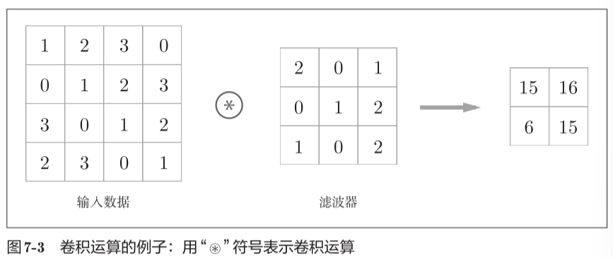

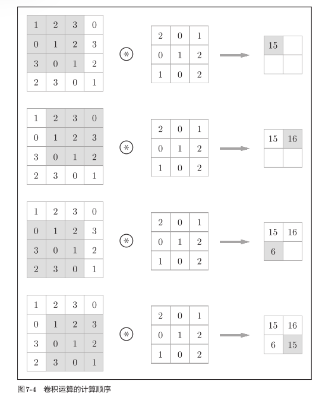

将各个位置上滤波器的元素和输入的对应元素相乘，然后再求和（有时将这个计算称为乘积累加运算）

滤波器的元素相当于全连接的神经网络的权重

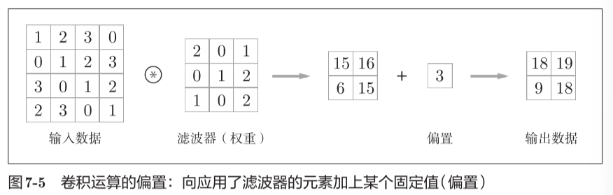

#### 7.2.3 填充

在进行卷积层的处理之前，有时要向输入数据的周围填入固定的数据（比如0等），这称为填充（padding）

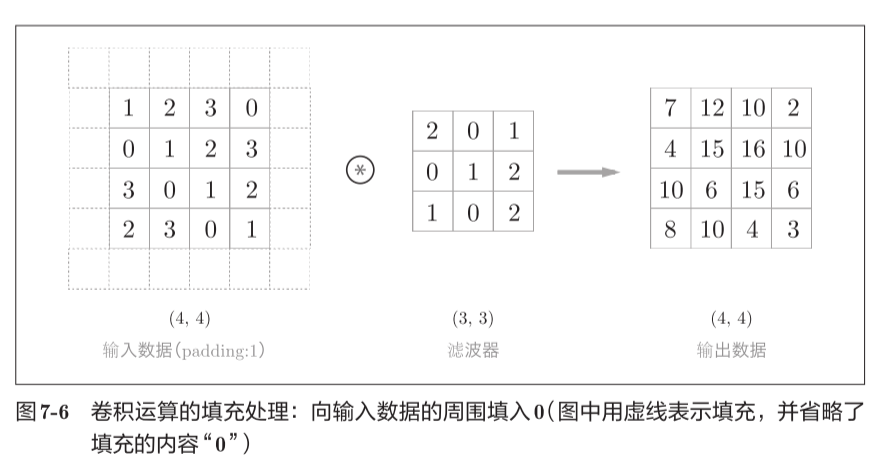

使用填充主要是为了调整输出的大小。如上图可以使输出数据也保持（4，4）的形状

这样卷积运算就可以在保持空间大小不变的情况下将数据传给下一层。

#### 7.2.4 步幅

应用滤波器的位置间隔称为步幅（stride）

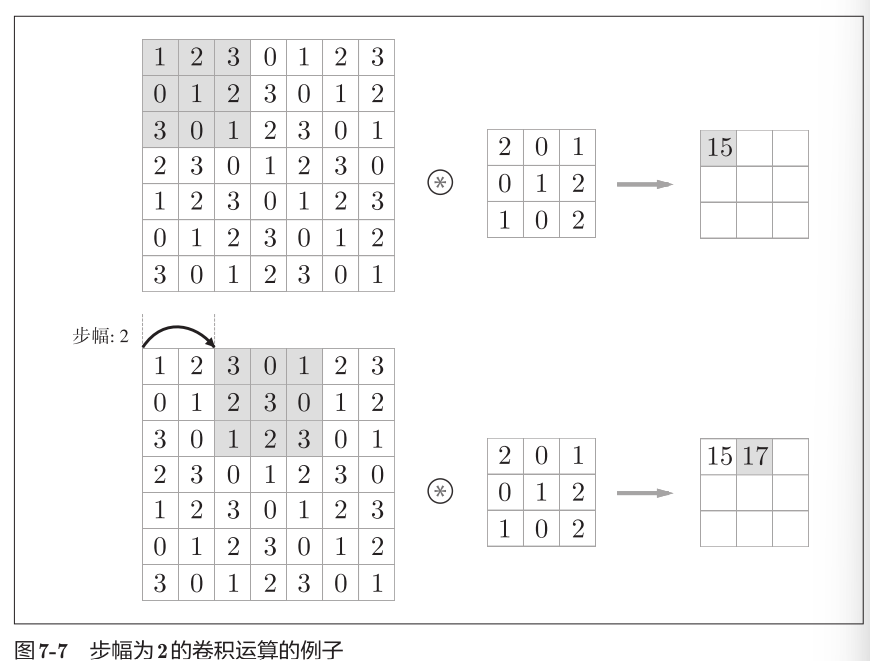

增大步幅后，输出大小会变小。而增大填充后，输出大小会变大。

设输入大小为(H,W)，滤波器大小为(FH,FW)，输出大小为(OH,OW)，填充为P，步幅为S

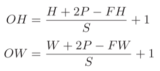

输出 = （输入 + 2\*填充 - 滤波器 ）/ 步幅 + 1

eg.

#### 7.2.5 3维数据的卷积运算

通道方向上有多个特征图时，会按通道进行输入数据和滤波器的卷积运算，并将结果相加，从而得到输出。

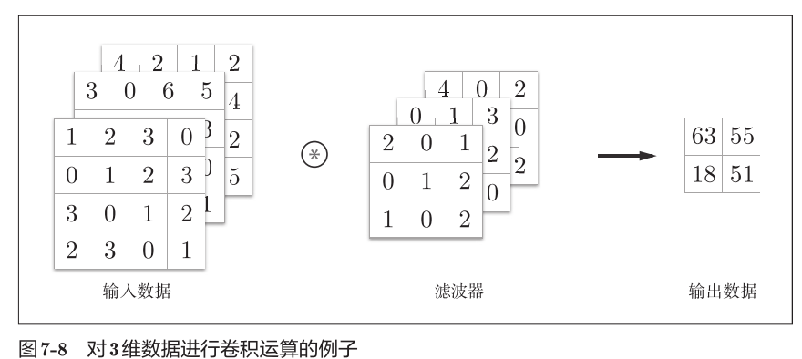

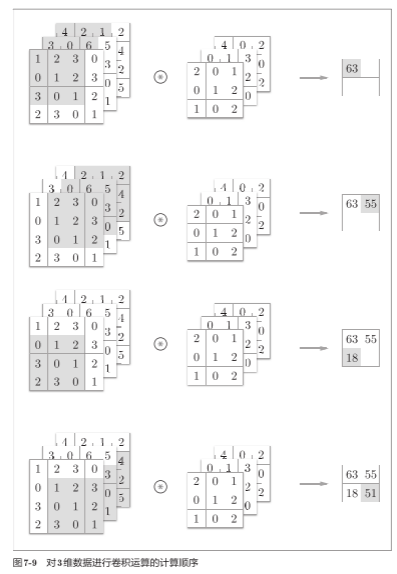

输入数据和滤波器的通道数要设为相同的值。

#### 7.2.6 结合方块思考

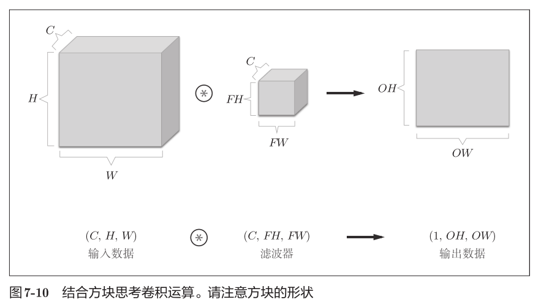

如果要在通道方向上也拥有多个卷积运算的输出：就需要用到多个滤波器（权重）

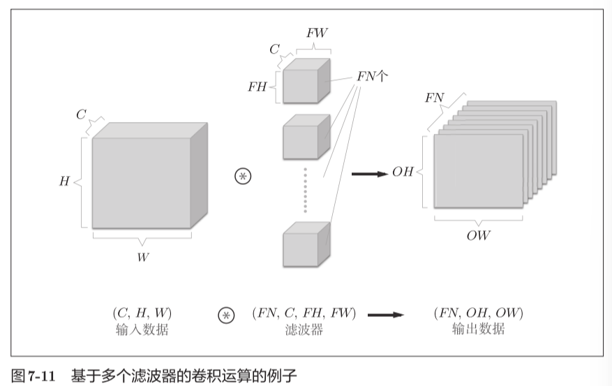

通过应用FN个滤波器，输出特征图也生成了FN个

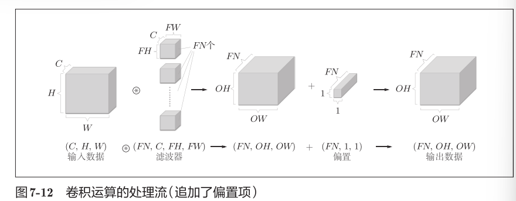

#### 7.2.7 批处理

网络间传递的是4维数据，对这N个数据进行了卷积运算。也就是说，批处理将N次的处理汇总成了1次进行。

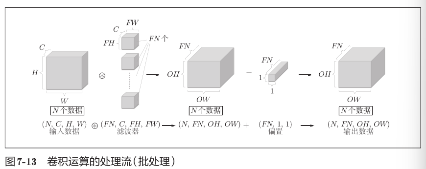

## 7.3 池化层

池化是缩小高、长方向上的空间的运算。

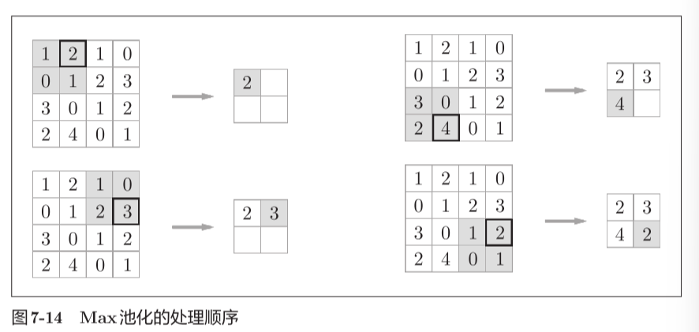

上图步幅为2，每次取2\*2目标区域的最大值

Max池化是从目标区域中取出最大值，Average池化则是计算目标区域的平均值。

在图像识别领域，主要使用Max池化。

池化层的特征

1. 没有要学习的参数

池化层和卷积层不同，没有要学习的参数。池化只是从目标区域中取最大值（或者平均值），所以不存在要学习的参数。

2. 通道数不发生变化

经过池化运算，输入数据和输出数据的通道数不会发生变化。计算是按通道独立进行的。

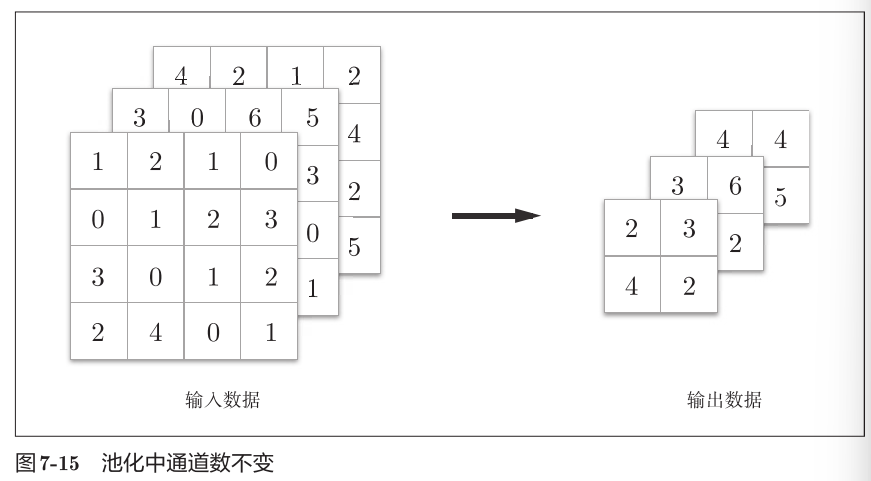

3. 对微小的位置变化具有鲁棒性（健壮）

输入数据发生微小偏差时，池化仍会返回相同的结果。因此，池化对输入数据的微小偏差具有鲁棒性。比如，3 × 3的池化的情况下，池化会吸收输入数据的偏差（根据数据的不同，结果有可能不一致）。

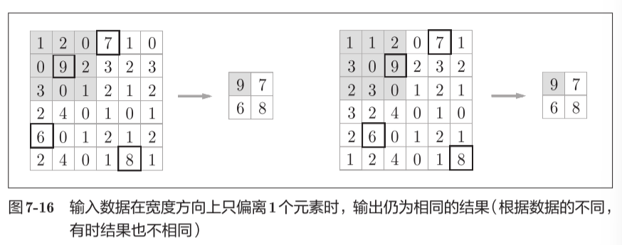

## 7.4 卷积层和池化层的实现

#### 7.4.1 4维数组

CNN中各层间传递的数据是4维数据，下例对应10个高为28、长为28、通道为1的数据

>>> x = np.random.rand(10, 1, 28, 28) # 随机生成数据

>>> x.shape

(10, 1, 28, 28)

>>> x[0].shape # (1, 28, 28) #访问第一个元素

>>> x[1].shape # (1, 28, 28)

>>> x[0, 0] # 或者x[0][0] #访问第一个数据的第一个通道的空间数据

#### 7.4.2 基于im2col的展开

im2col是一个函数，将输入数据展开以适合滤波器（权重）

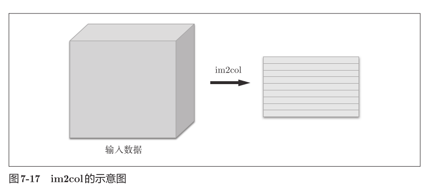

数据输入后会被转换成2维数据

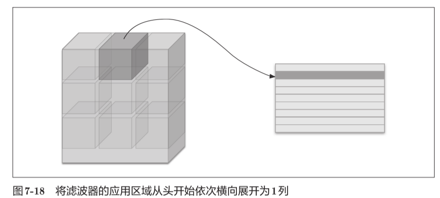

实际计算中，步幅很小，使用im2col展开后，展开后的元素个数会多于原方块的元素个数。

优点：矩阵形式更方便处理，计算更高速

缺点：会消耗更多内存

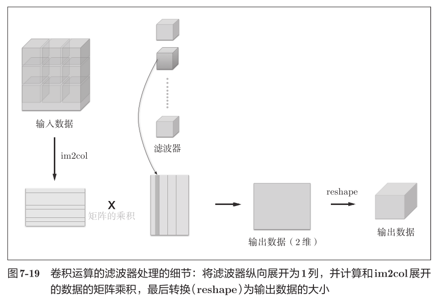

#### 7.4.3 卷积层的实现

im2col (input\_data, filter\_h, filter\_w, stride=1, pad=0)

im2col会考虑滤波器大小、步幅、填充，将输入数据展开为2维数组。

import sys, os

sys.path.append(os.pardir)

from common.util import im2col

x1 = np.random.rand(1, 3, 7, 7) #一个数据

col1 = im2col(x1, 5, 5, stride=1, pad=0)

print(col1.shape) # (9, 75) 75=3\*5\*5

x2 = np.random.rand(10, 3, 7, 7) # 10个数据

col2 = im2col(x2, 5, 5, stride=1, pad=0)

print(col2.shape) # (90, 75)

实现卷积层：

class Convolution:

def \_\_init\_\_(self, W, b, stride=1, pad=0):

self.W = W

self.b = b

self.stride = stride

self.pad = pad

def forward(self, x):

FN, C, FH, FW = self.W.shape #滤波器

N, C, H, W = x.shape #输入

out\_h = int(1 + (H + 2\*self.pad - FH) / self.stride)

out\_w = int(1 + (W + 2\*self.pad - FW) / self.stride)

col = im2col(x, FH, FW, self.stride, self.pad)

col\_W = self.W.reshape(FN, -1).T # 滤波器的展开

out = np.dot(col, col\_W) + self.b #卷积计算

out = out.reshape(N, out\_h, out\_w, -1).transpose(0, 3, 1, 2)

#将输出大小转换为合适的形状

return out

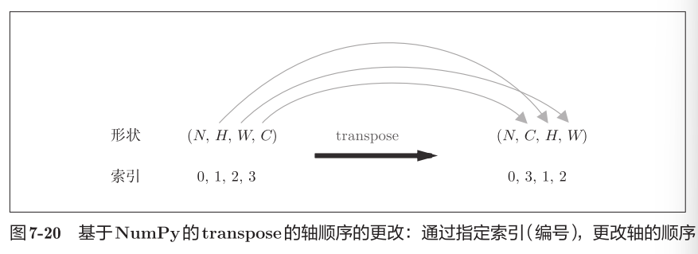

im2col 其实就是为了简化矩阵，便于高速计算

#### 7.4.4 池化层的实现

池化层的实现和卷积层相同，都使用im2col展开输入数据，

但是池化的应用区域按通道单独展开。

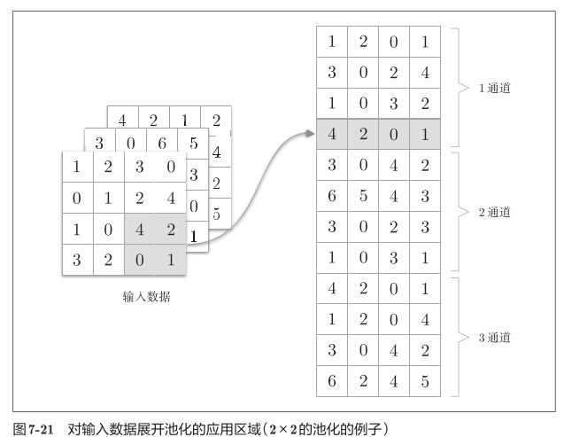

展开之后，只需对展开的矩阵求各行的最大值，并转换为合适的形状即可

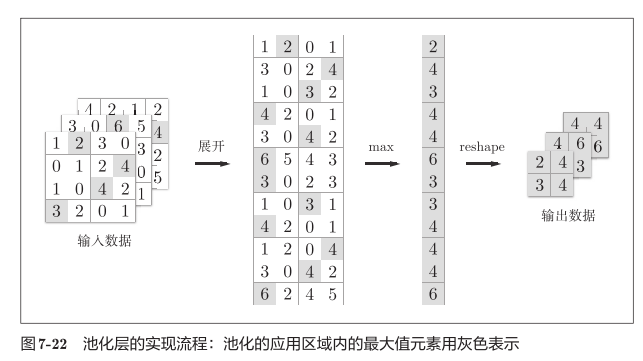

class Pooling:

def \_\_init\_\_(self, pool\_h, pool\_w, stride=1, pad=0):

self.pool\_h = pool\_h

self.pool\_w = pool\_w

self.stride = stride

self.pad = pad

def forward(self, x):

N, C, H, W = x.shape

out\_h = int(1 + (H - self.pool\_h) / self.stride)

out\_w = int(1 + (W - self.pool\_w) / self.stride)

# 展开(1)

col = im2col(x, self.pool\_h, self.pool\_w, self.stride, self.pad)

col = col.reshape(-1, self.pool\_h\*self.pool\_w)

# 最大值(2)

out = np.max(col, axis=1)

# 转换(3)

out = out.reshape(N, out\_h, out\_w, C).transpose(0, 3, 1, 2)

return out

np.max可以指定axis参数，并在这个参数指定的各个轴方向上求最大值。

1. 展开输入数据。
2. 求各行的最大值。
3. 转换为合适的输出大小。

## 7.5 CNN的实现

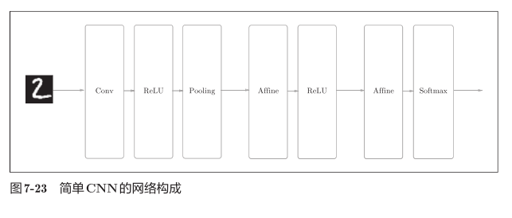

网络的构成是“Convolution - ReLU - Pooling -Affine -ReLU - Affine - Softmax”，我们将它实现为名为SimpleConvNet的类。

参数

• input\_dim―输入数据的维度：（通道，高，长）

• conv\_param―卷积层的超参数（字典）。字典的关键字如下：

filter\_num―滤波器的数量

filter\_size―滤波器的大小

stride―步幅

pad―填充

• hidden\_size―隐藏层（全连接）的神经元数量

• output\_size―输出层（全连接）的神经元数量

• weitght\_int\_std―初始化时权重的标准差

SimpleConvNet的类初始化：

class SimpleConvNet:

def \_\_init\_\_(self, input\_dim=(1, 28, 28),

conv\_param={'filter\_num':30, 'filter\_size':5,'pad':0, 'stride':1},

hidden\_size=100, output\_size=10, weight\_init\_std=0.01):

filter\_num = conv\_param['filter\_num']

filter\_size = conv\_param['filter\_size']

filter\_pad = conv\_param['pad']

filter\_stride = conv\_param['stride']

input\_size = input\_dim[1]

conv\_output\_size = (input\_size - filter\_size + 2\*filter\_pad) / \filter\_stride + 1

pool\_output\_size = int(filter\_num \* (conv\_output\_size/2) \*(conv\_output\_size/2))

权重参数初始化：

self.params = {}

self.params['W1'] = weight\_init\_std \* \np.random.randn(filter\_num, input\_dim[0],filter\_size, filter\_size)

self.params['b1'] = np.zeros(filter\_num)

self.params['W2'] = weight\_init\_std \*\np.random.randn(pool\_output\_size,hidden\_size)

self.params['b2'] = np.zeros(hidden\_size)

self.params['W3'] = weight\_init\_std \* \np.random.randn(hidden\_size,output\_size)

self.params['b3'] = np.zeros(output\_size)

生成必要层：

self.layers = OrderedDict()

self.layers['Conv1'] =Convolution(self.params['W1'],self.params['b1'],conv\_param['stride'],

conv\_param['pad'])

self.layers['Relu1'] = Relu()

self.layers['Pool1'] = Pooling(pool\_h=2, pool\_w=2, stride=2)

self.layers['Affine1'] = Affine(self.params['W2'],self.params['b2'])

self.layers['Relu2'] = Relu()

self.layers['Affine2'] = Affine(self.params['W3'],self.params['b3'])

self.last\_layer = softmaxwithloss()

## 7.6 CNN的可视

#### 7.6.1 第1层权重的可视化

学习前的滤波器是随机进行初始化的，所以在黑白的浓淡上没有规律可循，但学习后的滤波器变成了有规律的图像。

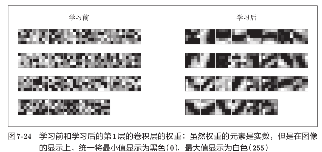

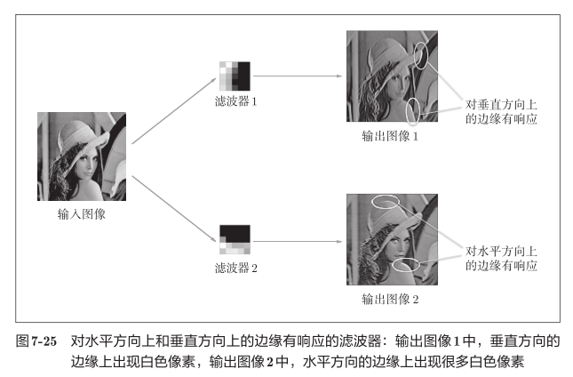

#### 7.6.2 基于分层结构的信息提取

随着CNN层次加深，提取的信息（正确地讲，是反映强烈的神经元）也越来越复杂、抽象。

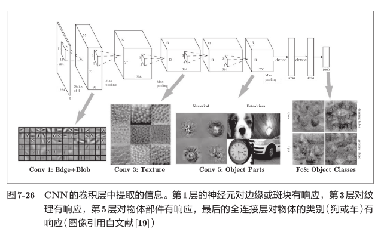

## 7.7 具有代表性的CNN

#### 7.7.1 LeNet

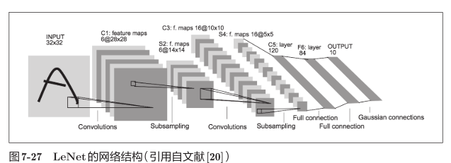

不同点：

1. 激活函数：LeNet中使用sigmoid函数，而现在的CNN中主要使用ReLU函数。
2. 原始的LeNet中使用子采样（subsampling）缩小中间数据的大小，而

现在的CNN中Max池化是主流。

#### 7.7.2 AlexNet

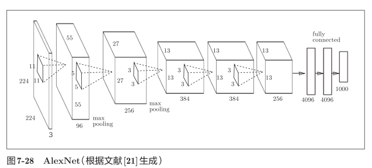

AlexNet叠有多个卷积层和池化层，最后经由全连接层输出结果。

• 激活函数使用ReLU。

• 使用进行局部正规化的LRN（Local Response Normalization）层。

• 使用Dropout。

