深度学习是加深了层的深度神经网络。

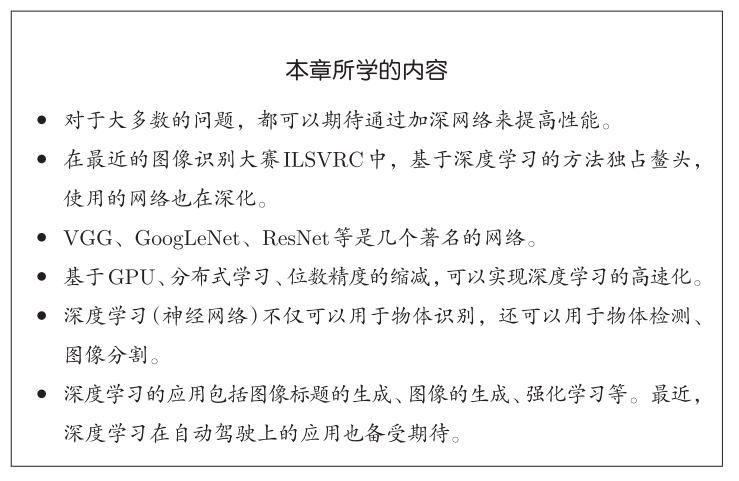

## 8.1 加深网络

#### 8.1.1 向更深的网络出发

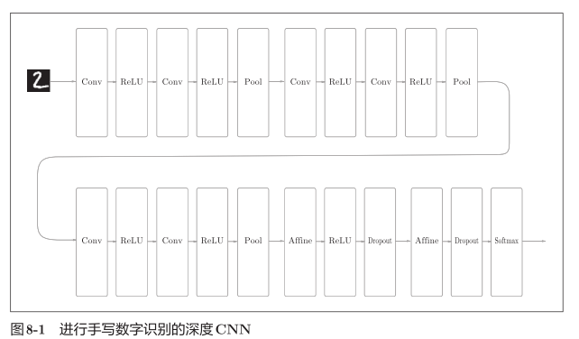

• 基于3×3的小型滤波器的卷积层。

• 激活函数是ReLU。

• 全连接层的后面使用Dropout层。

• 基于Adam的最优化。

• 使用He初始值作为权重初始值。

精度很高99.38%

#### 8.1.2 进一步提高识别精度

Data Augmentation（数据扩充）基于算法“人为地”扩充输入图像（训练图像）。

对于输入图像，通过施加旋转、垂直或水平方向上的移动等微小变化，增加图像的数量。这在数据集的图像数量有限时尤其有效。

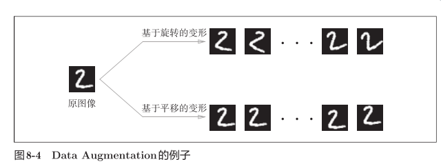

#### 8.1.3 加深层的动机

1. 可以减少网络的参数数量，扩大感受野（receptive field，给神经元施加变化的某个局部空间区域）
2. 提高网络表现力。将ReLU等激活函数夹在卷积层的中间，通过非线性函数的叠加，可以表现更加复杂的东西
3. 学习更高效。通过加深层，可以减少学习数据，从而高效地进行学习。
4. 通过加深层，可以将各层要学习的问题分解成容易解决的简单问题，从而可以进行高效的学习。

## 8.2 深度学习的历史

#### 8.2.1 ImageNet

ImageNet是拥有超过100万张图像的数据集

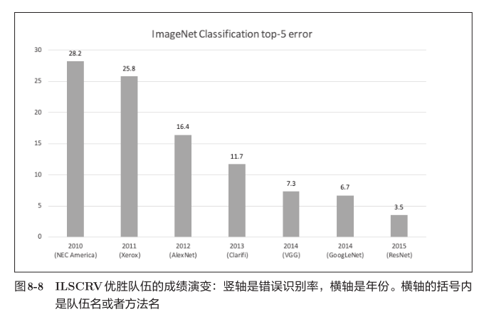

#### 8.2.2 VGG

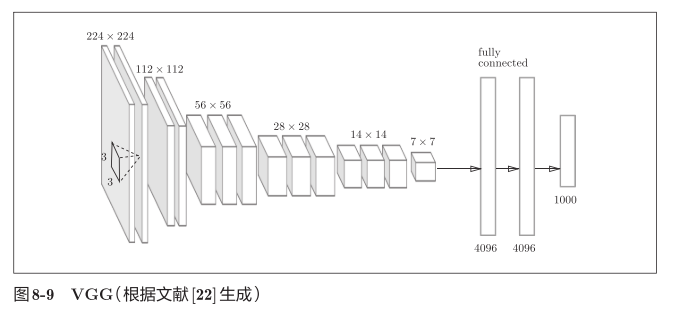

VGG是由卷积层和池化层构成的基础的CNN，结构简单，应用性强

特点在于将有权重的层（卷积层或者全连接层）叠加至16层（或者19层），具备了深度（根据层的深度，有时也称为“VGG16”或“VGG19”），基于3×3的小型滤波器的卷积层的运算是连续进行的

重复进行“卷积层重叠2次到4次，再通过池化层将大小减半”的处理，最后经由全连接层输出结果。

#### 8.2.3 GoogLeNet

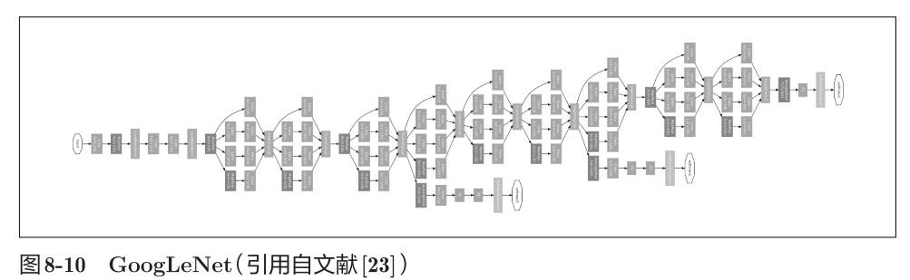

GoogLeNet的特征：网络不仅在纵向上有深度，在横向上也有深度（广度）。

GoogLeNet在横向上有“宽度”，这称为“Inception结构”

Inception结构使用了多个大小不同的滤波器（和池化），最后再合并它们的结果。GoogLeNet的特征就是将这个Inception结构用作一个构件（构成元素）。

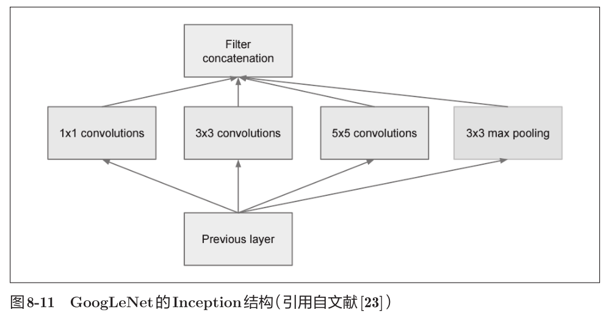

1 × 1的滤波器的卷积层。这个1 × 1的卷积运算通过在通道方向上减小大小，有助于减少参数和实现高速化处理

#### 8.2.4 ResNet

特征在于具有比以前的网络更深的结构。

导入了“快捷结构”（也称为“捷径”或“小路”）。导入这个快捷结构后，就可以随着层的加深而不断提高性能了（当然，层的加深也是有限度的）。快捷结构横跨（跳过）了输入数据的卷积层，将输入x合计到输出。

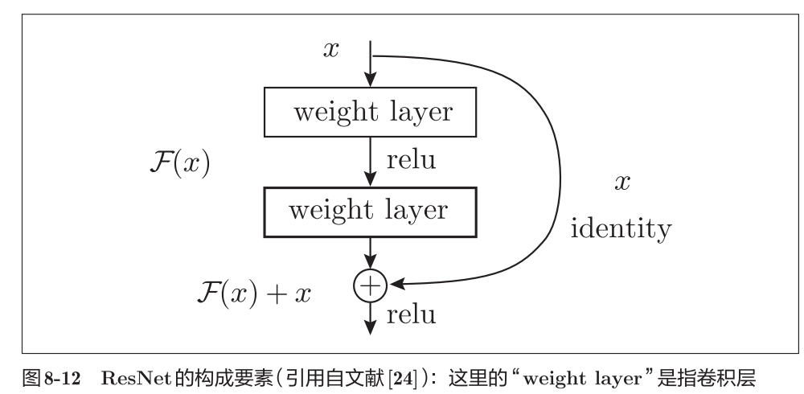

可以缓解因为加深层而导致的梯度变小的梯度消失问题

ResNet以前面介绍过的VGG网络为基础，引入快捷结构以加深层

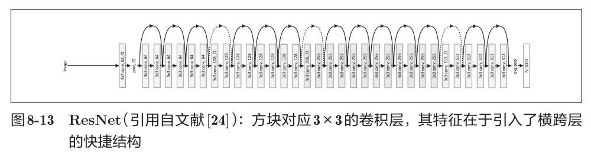

实践中经常会灵活应用使用ImageNet这个巨大的数据集学习到的权重数据，这称为迁移学习，将学习完的权重（的一部分）复制到其他神经网络，进行再学习（fine tuning）。比如，准备一个和VGG相同结构的网络，把学习完的权重作为初始值，以新数据集为对象，进行再学习。迁移学习在手头数据集较少时非常有效。

## 8.3 深度学习的高速化

GPU（Graphics Processing Unit），可以高速地处理大量的运算。

#### 8.3.1 需要努力解决的问题

如何高速、高效地进行卷积层中的运算是深度学习的一大课题。卷积层中进行的运算可以追溯至乘积累加运算。因此，深度学习的高速化的主要课题就变成了如何高速、高效地进行大量的乘积累加运算。

#### 8.3.2 基于GPU的高速化

GPU计算的目标就是将这种压倒性的计算能力用于各种用途。所谓GPU计算，是指基于GPU进行通用的数值计算的操作。

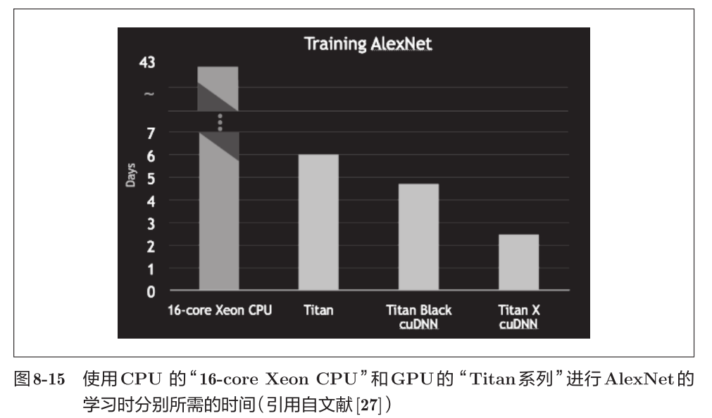

#### 8.3.3 分布式学习

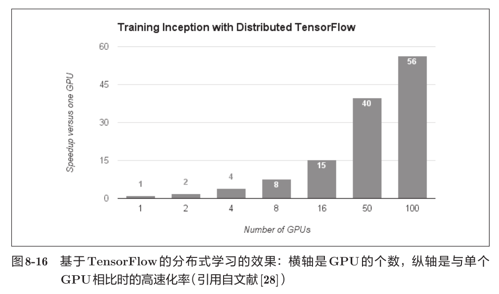

随着GPU个数的增加，学习速度也在提高

#### 8.3.4 运算精度的位数缩减

关于总线带宽，当流经GPU（或者CPU）总线的数据超过某个限制时，就会成为瓶颈。考虑到这些情况，我们希望尽可能减少流经网络的数据的位数。

神经网络的健壮性：即便输入图像附有一些小的噪声，输出结果也仍然保持不变。（Batch Norm）

所以深度学习并不那么需要数值精度的位数。

计算机中表示小数时，有32位的单精度浮点数和64位的双精度浮点数等格式。根据以往的实验结果，在深度学习中，即便是16位的半精度浮点数（half float），也可以顺利地进行学习

## 8.4 深度学习的应用案例

#### 8.4.1 物体检测

物体检测是比物体识别更难的问题。

物体识别是以整个图像为对象的，但是物体检测需要从图像中确定类别的位置，而且还有可能存在多个物体。

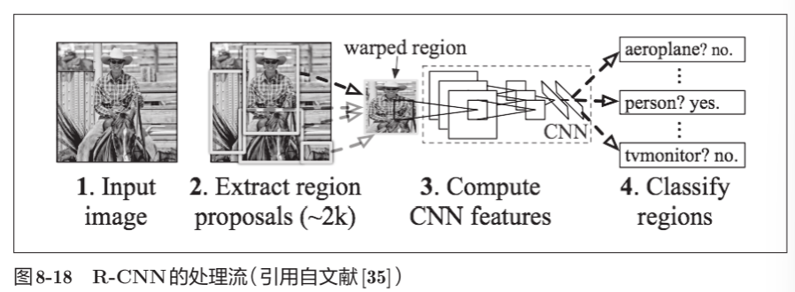

R-CNN 首先（以某种方法）找出形似物体的区域，然后对提取出的区域应用CNN进行分类。

#### 8.4.2 图像分割

图像分割是指在像素水平上对图像进行分类。

使用以像素为单位对各个对象分别着色的监督数据进行学习。然后，在推理时，对输入图像的所有像素进行分类。

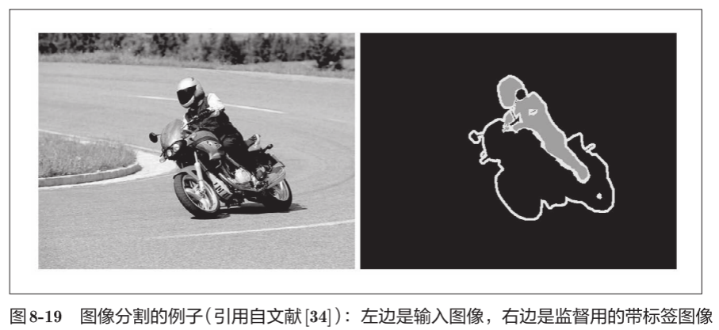

FCN（Fully ConvolutionalNetwork）通过一次forward处理，对所有像素进行分类

相对于一般的CNN包含全连接层，FCN将全连接层替换成发挥相同作用的卷积层

FCN的特征在于最后导入了扩大空间大小的处理

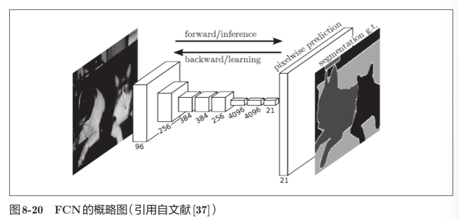

#### 8.4.3 图像标题的生成

给出一个图像后，会自动生成介绍这个图像的文字（图像的标题）

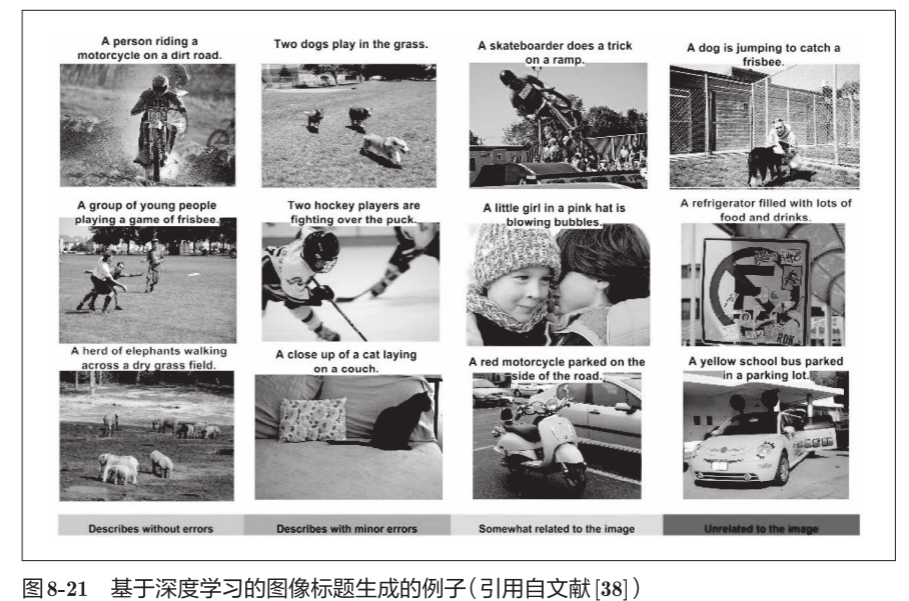

NIC（Neural Image Caption）：由深层的CNN和处理自然语言的RNN（Recurrent Neural Network）构成

NIC基于CNN从图像中提取特征，并将这个特征传给RNN。RNN以CNN提取出的特征为初始值，递归地生成文本。

组合图像和自然语言等多种信息进行的处理称为多模态处理

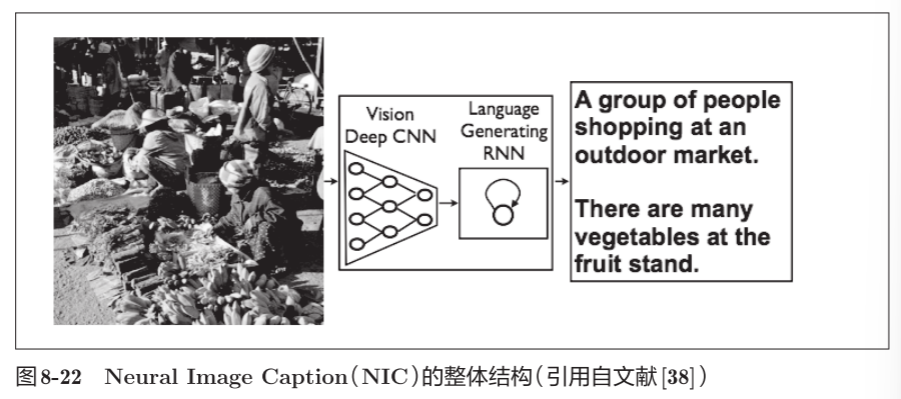

RNN的R表示Recurrent（递归的）。这个递归指的是神经网络的递归的网络结构。

## 8.5 深度学习的未来

#### 8.5.1 图像风格变换

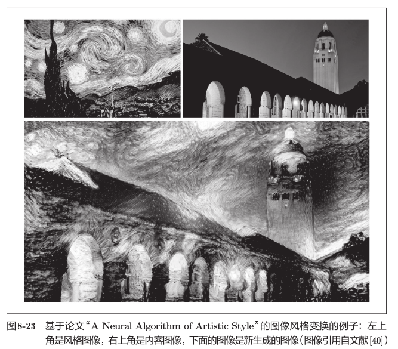

#### 8.5.2 图像的生成

生成新的图像时不需要任何图像

DCGAN（Deep Convolutional Generative Adversarial Network）

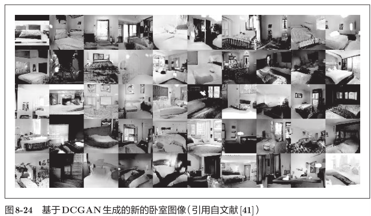

使用了Generator（生成者）和Discriminator（识别者）这两个神经网络。Generator生成近似真品的图像，Discriminator判别它是不是真图像（是Generator生成的图像还是实际拍摄的图像）。以竞争的方式学习

无监督学习（unsupervised learning）

#### 8.5.3 自动驾驶

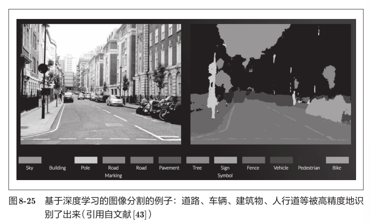

#### 8.5.4 Deep Q-Network（强化学习）

计算机在摸索试验的过程中自主学习，这称为强化学习（reinforcement learning）

强化学习的基本框架是，代理（Agent）根据环境选择行动，然后通过这个行动改变环境。根据环境的变化，代理获得某种报酬。

强化学习的目的是决定代理的行动方针，以获得更好的报酬（预期报酬）

Deep Q-Network（通称DQN）基于被称为Q学习的强化学习算法。

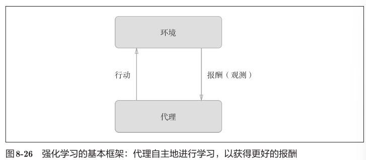

在Q学习中，为了确定最合适的行动，需要确定一个被称为最优行动价值函数的函数。DQN使用CNN

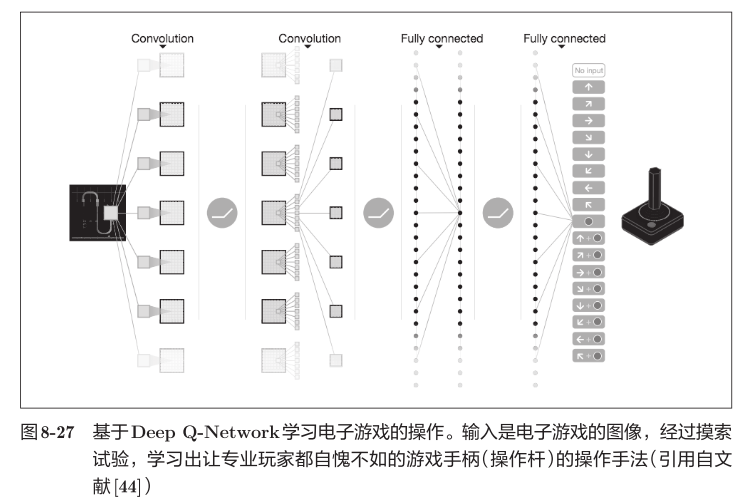

